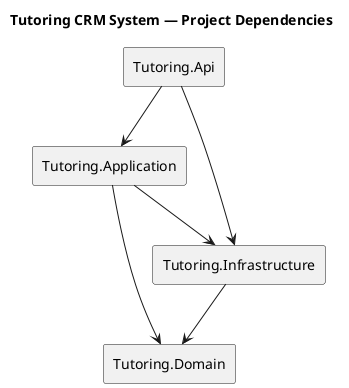
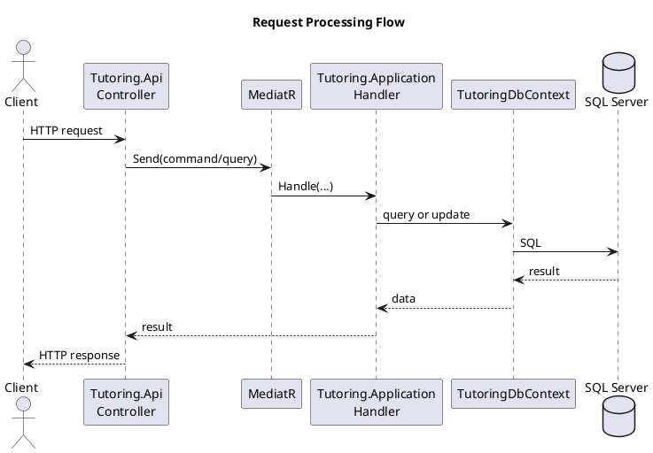

# Tutoring CRM System Architecture

## 1. Purpose

This document describes the technical organization of the Tutoring CRM System.

It is intended for developers and AI agents working with the repository. It explains where code belongs, how use cases are structured, and how requests flow through the system.

---

## 2. Solution Structure

```text
TutoringManagementSystem/
├── Tutoring.Api/
├── Tutoring.Application/
├── Tutoring.Domain/
├── Tutoring.Infrastructure/
└── TutoringManagementSystem.sln
```

### Tutoring.Api

Contains the HTTP layer:

* controllers,
* HTTP request and response models,
* ASP.NET Core configuration,
* dependency injection configuration,
* OpenAPI configuration,
* `GlobalExceptionHandler`.

### Tutoring.Application

Contains application use cases:

* commands,
* queries,
* MediatR handlers,
* use-case results,
* application exceptions.

Features are organized using Vertical Slice Architecture.

```text
Tutoring.Application/
├── Common/
│   └── Exceptions/
│       ├── UseCaseException.cs
│       ├── NotFoundException.cs
│       └── ConflictException.cs
│
└── Features/
    └── Students/
        ├── Exceptions/
        │   └── StudentNotFoundException.cs
        │
        └── GetStudentById/
            ├── GetStudentByIdQuery.cs
            ├── GetStudentByIdHandler.cs
            └── GetStudentByIdResult.cs
```

### Tutoring.Domain

Contains the business model:

* entities,
* aggregate roots,
* value objects,
* domain exceptions,
* business rules.

```text
Tutoring.Domain/
├── Common/
│   ├── EmailAddress.cs
│   └── Exceptions/
│
└── Students/
    └── Student.cs
```

### Tutoring.Infrastructure

Contains persistence implementation:

* `TutoringDbContext`,
* EF Core entity configurations,
* migrations,
* SQL Server integration.

```text
Tutoring.Infrastructure/
└── Persistence/
    ├── TutoringDbContext.cs
    ├── Configurations/
    │   └── StudentConfiguration.cs
    └── Migrations/
```

---

## 3. Project Dependencies



`Tutoring.Api` receives HTTP requests and sends commands or queries through MediatR.

`Tutoring.Application` executes use cases using the domain model and `TutoringDbContext`.

`Tutoring.Infrastructure` maps domain objects to the database using Entity Framework Core.

---

## 4. Use Case Organization

Each use case has its own directory.

Example:

```text
Features/
└── Students/
    ├── CreateStudent/
    ├── GetStudentById/
    ├── UpdateStudent/
    └── DeleteStudent/
```

A query slice usually contains:

```text
GetStudentById/
├── GetStudentByIdQuery.cs
├── GetStudentByIdHandler.cs
└── GetStudentByIdResult.cs
```

A command slice usually contains:

```text
CreateStudent/
├── CreateStudentCommand.cs
├── CreateStudentHandler.cs
└── CreateStudentResult.cs
```

HTTP-specific models remain in `Tutoring.Api`.

```text
Tutoring.Api/
└── Features/
    └── Students/
        └── GetStudentById/
            ├── GetStudentByIdController.cs
            └── GetStudentByIdResponse.cs
```

---

## 5. Request Flow



Queries use EF Core projections and `AsNoTracking()`.

Commands load or create domain entities, execute domain operations and call `SaveChangesAsync()`.

---

## 6. Exception Handling

The system uses two main exception groups:

```text
DomainException
UseCaseException
```

Domain exceptions represent business rule violations.

Application exceptions represent use-case failures, such as a missing resource or conflict.

Current HTTP mapping:

```text
NotFoundException  → 404 Not Found
ConflictException  → 409 Conflict
DomainException    → 422 Unprocessable Entity
UseCaseException   → 400 Bad Request
Other exceptions   → 500 Internal Server Error
```

The mapping is handled centrally by `GlobalExceptionHandler` in `Tutoring.Api`.

---

## 7. Instructions for AI Agents

When adding or modifying functionality:

1. Identify the business area and use case.
2. Place commands, queries and handlers in `Tutoring.Application/Features`.
3. Place HTTP controllers and response models in `Tutoring.Api`.
4. Place entities, value objects and business rules in `Tutoring.Domain`.
5. Place EF Core configurations and migrations in `Tutoring.Infrastructure`.
6. Use `TutoringDbContext` directly inside application handlers.
7. Preserve the existing exception hierarchy and error codes.
8. Group files by use case, not by technical type.
9. Update EF Core migrations when the database model changes.
10. Verify changes with:

```bash
dotnet build
```
