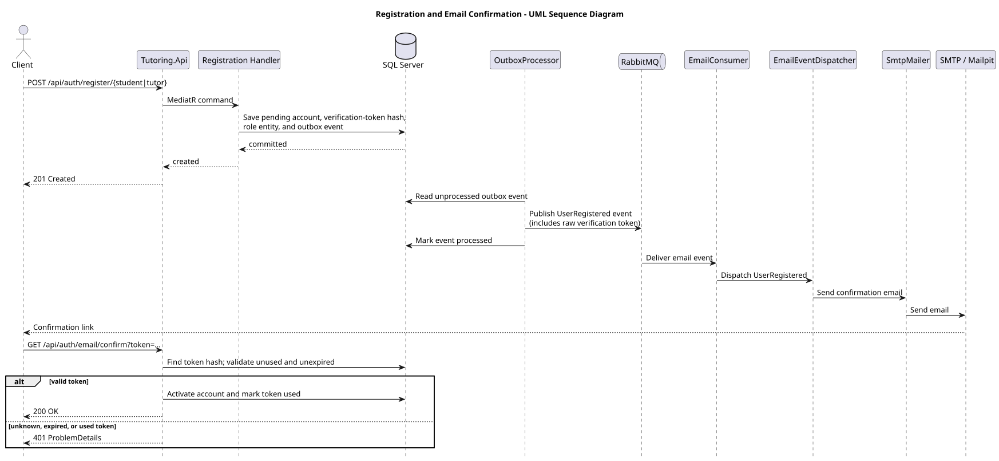

# US-001 — Account registration

> As a new user, I want to create an account as a tutor or student so that I can start using the system.

## Scope

A new user registers as a Student or Tutor. The account starts as `PendingActivation` and a role-specific entity (`Student`/`Tutor`) is created in the same transaction. A verification email is sent asynchronously through the outbox/RabbitMQ pipeline; confirming the link activates the account.

## API

| Method | Endpoint | Auth | Result |
| --- | --- | --- | --- |
| POST | `/api/auth/register/student` | Anonymous | Creates a pending Student account, returns `201 Created`. |
| POST | `/api/auth/register/tutor` | Anonymous | Creates a pending Tutor account, returns `201 Created`. |
| GET | `/api/auth/email/confirm?token=...` | Anonymous | Confirms the email and activates the account. |

## Implementation

- Registration validates email/username/phone uniqueness and the password policy before creating the account.
- One EF Core transaction saves the `UserAccount` (`PendingActivation`), the role-specific entity, an `EmailVerificationToken` (SHA-256 hash only), and a `UserRegistered` outbox message.
- `AssignRole` is called with `UserRole.Student` or `UserRole.Tutor` on the new account.
- `OutboxProcessor` publishes the outbox event to RabbitMQ; `EmailConsumer` routes it through `EmailEventDispatcher` to `UserRegisteredEmailHandler`, which sends the confirmation link via `SmtpMailer` (Mailpit locally).
- `GET /api/auth/email/confirm` looks up the token by hash; unknown, expired, or already-used tokens return `401 Auth.InvalidEmailVerificationToken`. A valid token activates the account and marks the token used.
- A pending (unconfirmed) account cannot log in — see [US-002](../us_002/README.md).

## Diagram

## Tests

`Tutoring.IntegrationTests`: successful registration for both roles, duplicate email/username/phone conflicts, outbox message creation, and email confirmation with valid/unknown/expired/used tokens.
