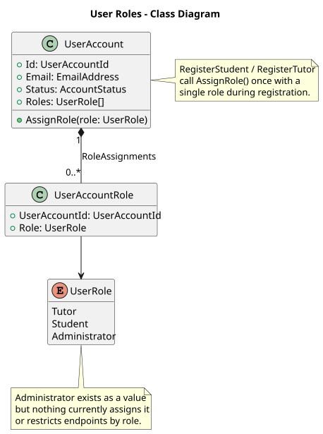

# US-003 — Tutor, Student, and Administrator roles

> As an administrator, I want the system to distinguish tutor, student, and administrator roles so that each person has the right level of access.

## Scope

`UserAccount` supports multiple role assignments through `UserAccountRole`/`UserRole` (`Tutor`, `Student`, `Administrator`). Registration assigns exactly one role (`Student` or `Tutor`) and the JWT carries the assigned roles as claims. There is no Administrator registration path and no role-based authorization yet — endpoints only check that a caller is authenticated (`[Authorize]`), not which role they hold.

## Implementation

- `UserAccount.AssignRole(UserRole role)` adds a `UserAccountRole` if not already present; it is idempotent per role.
- `RegisterStudentHandler`/`RegisterTutorHandler` each call `AssignRole` once with the corresponding role during registration.
- `JwtTokenGenerator` adds one `"role"` claim per assigned role to the access token.
- `UserRole.Administrator` exists in the enum and domain model but is never assigned by any current use case.
- Protected endpoints (e.g. `UpdateProfile`, `SignOutAll`) use plain `[Authorize]` — they require a valid JWT but do not check role claims. No `[Authorize(Roles = ...)]` or policy-based role restriction exists in the codebase.

## Diagram

## Tests

`Tutoring.UnitTest`: `UserAccountRole` and `UserRole` construction/equality behavior. No integration tests currently assert role-based access restrictions, since none are implemented.
