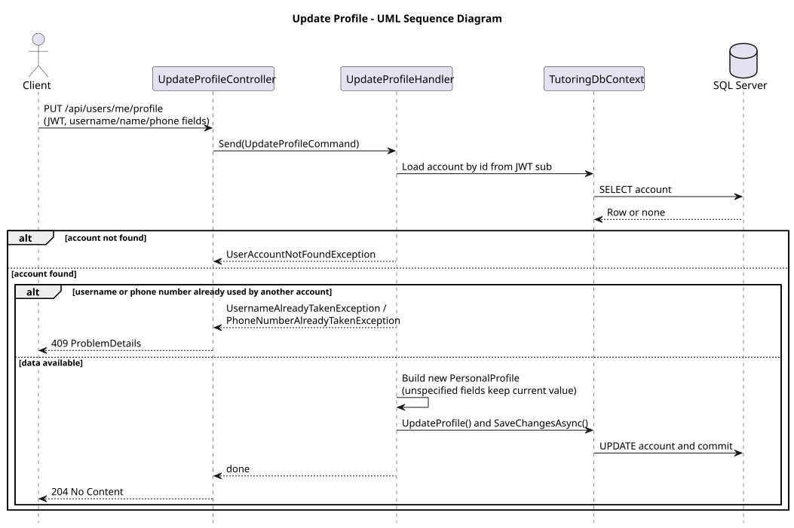
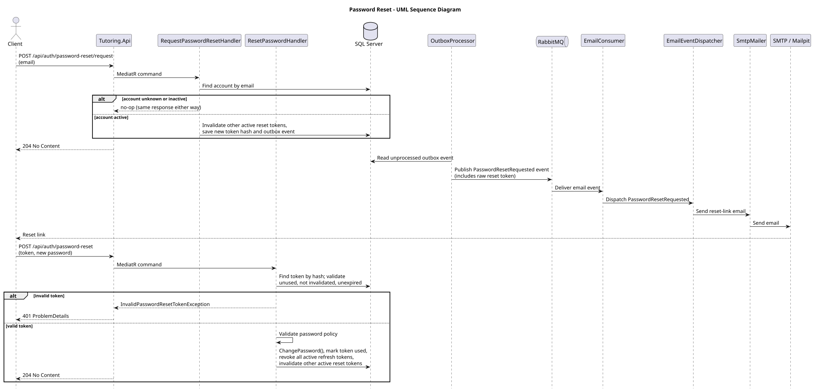

# US-004 — Edit profile data and password

> As a user, I want to edit my profile data and password so that my account information stays up to date.

## Scope

An authenticated user can update their username, first/last name, and phone number. Password changes go through a separate reset-token flow (request → emailed link → reset), independent of the profile update endpoint; there is no "change password while logged in" endpoint.

## API

| Method | Endpoint | Auth | Result |
| --- | --- | --- | --- |
| PUT | `/api/users/me/profile` | JWT | Updates username/name/phone for the authenticated account, returns `204 No Content`. |
| POST | `/api/auth/password-reset/request` | Anonymous | Emails a reset link if the account exists and is active; always returns `204 No Content`. |
| POST | `/api/auth/password-reset` | Anonymous (reset token) | Sets a new password for a valid, unused, unexpired token, returns `204 No Content`. |

## Implementation

- `UpdateProfileRequest` fields are all optional; unspecified fields keep their current value, and username/phone are checked for uniqueness against other accounts before saving.
- `RequestPasswordResetHandler` invalidates a user's other active reset tokens and creates a new one, saved with a `PasswordResetRequested` outbox event in the same transaction. It responds identically for unknown emails and inactive accounts to avoid leaking account existence.
- The outbox/RabbitMQ/email pipeline mirrors registration: `OutboxProcessor` → RabbitMQ → `EmailConsumer` → `EmailEventDispatcher` → `SmtpMailer`.
- `ResetPasswordHandler` validates the token hash, enforces the password policy, then changes the password, marks the token used, revokes all of the user's active refresh tokens (forces re-login everywhere), and invalidates the user's other active reset tokens.
- Invalid, expired, or already-used reset tokens return `401 InvalidPasswordResetToken`.

## Diagram

## Tests

`Tutoring.IntegrationTests`: profile update requiring authentication, successful update, username/phone conflicts; password-reset request token/outbox creation and inactive/unknown-account handling; password reset with valid/used/unknown/expired/invalidated tokens, policy violations, and refresh-token/reset-token invalidation side effects.
