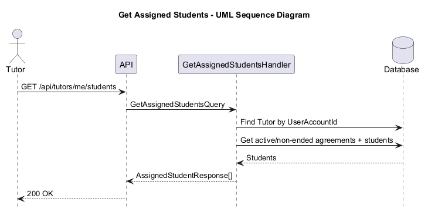

# US-005 — Get assigned students

> As a tutor, I want to see my assigned students so that I can manage the people I teach.

## Scope

`GET /api/tutors/me/students` returns the students assigned to the authenticated tutor. The endpoint requires the `Tutor` role; students and unauthenticated callers are rejected.

## Implementation
a caller's `sub` claim and sends `GetAssignedStudentsQuery` with the resolved `UserAccountId`.
- `GetAssignedStudentsHandler` looks up the `Tutor` by `UserAccountId`; if none exists, it returns an empty list instead of failing.
- Students are resolved via `TutoringAgreement` rows where `TutorId` matches the tutor and `Status != AgreementStatus.Ended`, projected `AsNoTracking` into `AssignedStudentResponse` (student id, display name, optional first/last name, account email/phone, status, subject, hourly rate, tutor-maintained contact email/phone, and notes). Managed students have no `UserAccount`, so their account-derived fields are `null`; agreement details are still returned.
- Ended agreements and agreements belonging to other tutors are excluded by the query filter, so no additional in-memory filtering is needed.

## Diagram

## Tests

`Tutoring.IntegrationTests.Features.Tutors.GetAssignedStudents.GetAssignedStudentsTests`: missing access token (`401`), `Student` role caller (`403`), tutor with no assignments (`200` + empty list), registered and managed-student response mapping, tutor data isolation (Tutor A never sees Tutor B's students), and exclusion of `Ended` agreements.
