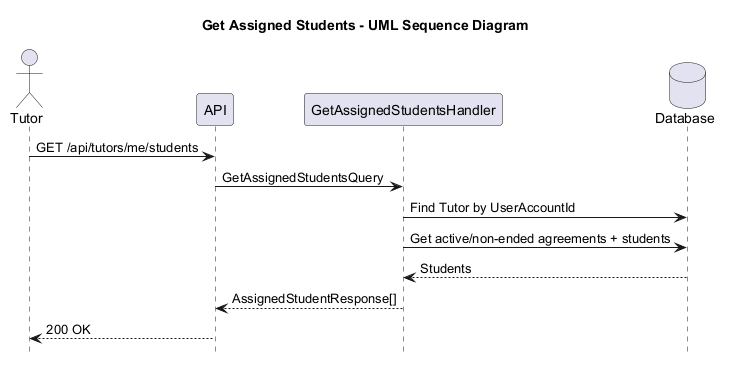

# US-005 — Get assigned students

> As a tutor, I want to see my assigned students so that I can manage the people I teach.

## Scope

`GET /api/tutors/me/students` returns the students assigned to the authenticated tutor together with their active tutoring agreements.

The endpoint requires the `Tutor` role; students and unauthenticated callers are rejected.

## FILES

- Implementation: [GetAssignedStudents](../../../../../TutoringManagementSystem/Tutoring.Api/Features/Tutors/GetAssignedStudents/)
- Tests: [GetAssignedStudents](../../../../../TutoringManagementSystem/Tutoring.IntegrationTests/Features/Tutors/GetAssignedStudents/)

## Implementation

- The caller's `sub` claim is resolved to `UserAccountId` and passed in `GetAssignedStudentsQuery`.
- `GetAssignedStudentsHandler` looks up the `Tutor` by `UserAccountId`. If no tutor exists, an empty list is returned.
- Students are resolved through `TutoringAgreement` rows where `TutorId` belongs to the authenticated tutor and `Status != AgreementStatus.Ended`.
- The response contains one `AssignedStudentResponse` per student. If the same student has multiple active tutoring agreements with the tutor, the student is returned only once.
- Each `AssignedStudentResponse` contains student-level data: student id, display name, optional first and last name, account email and phone number, and student status.
- Agreement-specific data is returned in the `Agreements` collection as `StudentAgreementResponse`. Each agreement contains `TutoringAgreementId`, subject, hourly rate, tutor-maintained contact email, contact phone number, and notes.
- Managed students without a `UserAccount` have `null` account-derived fields, while their tutoring agreements are still returned normally.
- Ended agreements and agreements belonging to other tutors are excluded.

## Response structure

```text
AssignedStudentResponse
├── StudentId
├── DisplayName
├── FirstName
├── LastName
├── Email
├── PhoneNumber
├── Status
└── Agreements[]
    ├── TutoringAgreementId
    ├── Subject
    ├── HourlyRate
    ├── ContactEmail
    ├── ContactPhoneNumber
    └── Notes
```

## Diagram



## Tests

`Tutoring.IntegrationTests.Features.Tutors.GetAssignedStudents.GetAssignedStudentsTests` covers:

- missing access token (`401`),
- `Student` role caller (`403`),
- tutor with no assignments (`200` with an empty list),
- registered student response mapping,
- managed student response mapping,
- registered and managed students returned together,
- tutor data isolation,
- exclusion of `Ended` agreements,
- multiple active agreements for the same student being returned as one student with multiple entries in the `Agreements` collection.