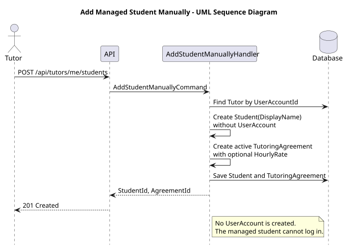
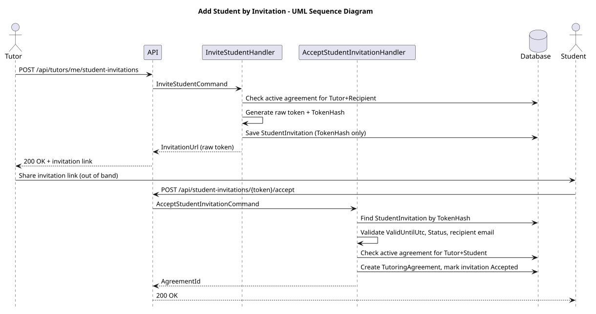

# US-006 — Add student manually or by invitation

> As a tutor, I want to add a student manually or by invitation so that I can start working with them in the system.

## Scope

A tutor can start cooperation in either of two ways:

- add a managed student manually, without creating a `UserAccount`; or
- invite a registered student by email, who then accepts the invitation while logged in with the invited email.

Both paths create an active `TutoringAgreement`. A managed student has a
`DisplayName` but no login credentials or account-derived contact details.

## API

| Method | Endpoint | Auth | Result |
| --- | --- | --- | --- |
| POST | `/api/tutors/me/students` | `Tutor` role | Creates a managed `Student` and active `TutoringAgreement`, returns `201 Created`. |
| POST | `/api/tutors/me/student-invitations` | `Tutor` role | Creates a `StudentInvitation` and returns an invitation link, returns `200 OK`. |
| POST | `/api/student-invitations/{token}/accept` | `Student` role | Accepts the invitation for the authenticated student, creates a `TutoringAgreement`, returns `200 OK`. |

## Implementation

- `AddStudentManuallyHandler` resolves the tutor from the `sub` claim, creates a managed `Student` with `DisplayName` and no `UserAccount`, then creates an active `TutoringAgreement` using the supplied title, subject, and optional hourly rate. It returns the created student and agreement identifiers.
- `InviteStudentHandler` resolves the tutor from the `sub` claim, rejects the request if the tutor already has a non-`Ended` `TutoringAgreement` with that recipient email (`409 Students.AlreadyAssigned`), then creates a `StudentInvitation` with `Status = Created` and `ValidUntilUtc = now + StudentInvitationOptions.ValidDays`.
- `IStudentInvitationTokenGenerator` generates a random raw token and its SHA-256 hash; only the hash (`TokenHash`) is persisted. The raw token is embedded once in the returned `InvitationUrl` and is never stored or logged.
- The same tutor can create multiple invitations for the same recipient email — this is intentional, there is no uniqueness constraint on `(TutorId, RecipientEmail)`.
- `AcceptStudentInvitationHandler` re-hashes the token from the route to look up the invitation (`404 StudentInvitations.NotFound` if unknown), then rejects it (`409 StudentInvitations.Unavailable`) if expired or not in `Created`/`Sent` status. It then resolves the caller's `Student` profile (`404 Students.NotFound` if missing), verifies the caller's email matches `Recipient` (`403 StudentInvitations.RecipientMismatch`), and rejects the request (`409 Students.AlreadyAssigned`) if an active `TutoringAgreement` for that Tutor+Student pair already exists.
- On success, a `TutoringAgreement` is created copying `Title`, `Subject`, and `HourlyRate` from the invitation, with `Status = Active`, and the invitation is marked `Accepted`.
- `HourlyRate` is optional on both the invitation and the resulting agreement.
- Because multiple invitations can exist for the same Tutor+Student pair, accepting one does not expire the others; the only enforced invariant is that at most one active `TutoringAgreement` can exist per Tutor+Student pair, so accepting a second invitation after the first was accepted is rejected as a conflict.

## Diagrams

### Manual add

### Invitation

## Tests

`Tutoring.IntegrationTests.Features.Tutors.AddStudentManually.AddStudentManuallyTests`: manual student and agreement persistence, optional `HourlyRate`, no `UserAccount` creation, authorization, missing tutor profile, value-object request errors, and visibility through `GET /api/tutors/me/students`.

`Tutoring.IntegrationTests.Features.Tutors.InviteStudent.InviteStudentTests`: role/authorization checks, invitation persisted with correct tutor/recipient/title/subject/hourly rate/validity/status, optional `HourlyRate`, raw token not stored (only its hash) while the link remains usable, multiple invitations allowed for the same recipient, and conflict when an active agreement already exists.

`Tutoring.IntegrationTests.Features.Students.AcceptStudentInvitation.AcceptStudentInvitationTests`: role/authorization checks, successful acceptance creating a matching `TutoringAgreement` and marking the invitation `Accepted`, optional `HourlyRate`, unknown/expired/already-accepted/rejected invitations, recipient email mismatch, missing `Student` profile, existing active agreement conflict, and the two-invitations-for-the-same-pair scenario where only one active agreement can ever exist.
