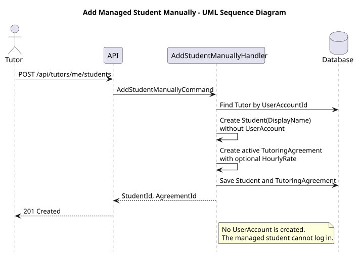
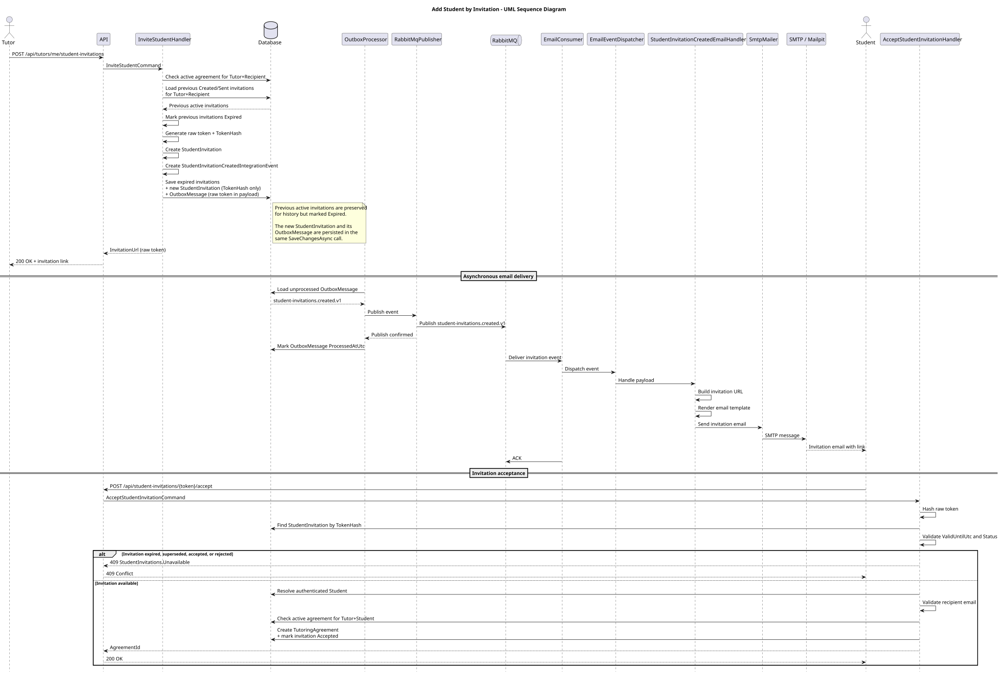

# US-006 — Add student manually or by invitation

> As a tutor, I want to add a student manually or by invitation so that I can start working with them in the system.

## Scope

A tutor can start cooperation in either of two ways:

- add a managed student manually, without creating a `UserAccount`; or
- invite a student by email, who can then accept the invitation while logged in with the invited email.

Both paths ultimately create an active `TutoringAgreement`. A managed student has a `DisplayName` but no login credentials or account-derived contact details.

Student invitations are delivered asynchronously. Creating an invitation persists the `StudentInvitation` together with an Outbox message in the same database operation. The Outbox pipeline publishes the invitation event to RabbitMQ, where the email consumer processes it and sends the invitation email through SMTP. Mailpit is used as the local SMTP sink.

Only the newest invitation for a given Tutor+Recipient pair remains available. When the tutor sends another invitation to the same email address, previous invitations in `Created` or `Sent` status are preserved for history but marked as `Expired`.

## FILES

- Implementation: [AddStudentManually](../../../../../TutoringManagementSystem/Tutoring.Api/Features/Tutors/AddStudentManually/), [InviteStudent](../../../../../TutoringManagementSystem/Tutoring.Api/Features/Tutors/InviteStudent/), [AcceptStudentInvitation](../../../../../TutoringManagementSystem/Tutoring.Api/Features/Students/AcceptStudentInvitation/)
- Messaging contract: `Tutoring.Infrastructure/Messaging/Contracts/StudentInvitationCreatedIntegrationEvent.cs`
- Email handler: `Tutoring.Infrastructure/Mailing/Handlers/StudentInvitationCreatedEmailHandler.cs`
- Email template: `Tutoring.Infrastructure/Mailing/Templates/StudentInvitationEmailTemplate.cs`
- Tests: [AddStudentManually](../../../../../TutoringManagementSystem/Tutoring.IntegrationTests/Features/Tutors/AddStudentManually/), [InviteStudent](../../../../../TutoringManagementSystem/Tutoring.IntegrationTests/Features/Tutors/InviteStudent/), [AcceptStudentInvitation](../../../../../TutoringManagementSystem/Tutoring.IntegrationTests/Features/Students/AcceptStudentInvitation/)

## API

| Method | Endpoint | Auth | Result |
| --- | --- | --- | --- |
| POST | `/api/tutors/me/students` | `Tutor` role | Creates a managed `Student` and active `TutoringAgreement`, returns `201 Created`. |
| POST | `/api/tutors/me/student-invitations` | `Tutor` role | Requires the recipient email to belong to an existing, registered `Student` (`404 Students.NotFound` otherwise); expires previous active invitations for the same Tutor+Recipient, creates a new `StudentInvitation`, schedules delivery through the Outbox pipeline, and returns an invitation link with `200 OK`. |
| POST | `/api/student-invitations/{token}/accept` | `Student` role | Accepts an available invitation for the authenticated student, creates a `TutoringAgreement`, returns `200 OK`. |

## Implementation

- `AddStudentManuallyHandler` resolves the tutor from the `sub` claim, creates a managed `Student` with `DisplayName` and no `UserAccount`, then creates an active `TutoringAgreement` using the supplied title, subject, and optional hourly rate. It returns the created student and agreement identifiers.

- `InviteStudentHandler` resolves the tutor from the `sub` claim, then verifies that the recipient email belongs to an existing, registered `Student` — that is, a `Student` with a linked `UserAccount` whose `Email` matches the recipient. This check runs before any agreement lookup, invitation expiration, token generation, or persistence. If no such `Student` exists, the request is rejected with `404 Students.NotFound`, no `StudentInvitation` or `OutboxMessage` is created, no previous invitations are expired, and a structured warning log (without the recipient's raw token or other sensitive data) is written.

- An email that only belongs to a `UserAccount` without an associated `Student` (for example a Tutor account) does not qualify as a registered student and is rejected the same way.

- This check does not require the student's `UserAccount` to be `Active`; any registered `Student` with a linked account and matching email is a valid invitation recipient, regardless of activation state.

- `InviteStudentHandler` rejects the request if the tutor already has a non-`Ended` `TutoringAgreement` with that recipient email (`409 Students.AlreadyAssigned`).

- Before creating a new invitation, `InviteStudentHandler` loads previous invitations for the same Tutor+Recipient pair whose status is `Created` or `Sent`. These entities are tracked by EF Core and are marked `Expired` through the domain `Expire()` method.

- Previous invitation records are not deleted. They remain stored as historical records, while their invitation tokens become unusable because `AcceptStudentInvitationHandler` only accepts invitations in `Created` or `Sent` status.

- `IStudentInvitationTokenGenerator` generates a random raw invitation token together with its SHA-256 hash. The `StudentInvitation` stores only the hash in `TokenHash`; the raw token is never stored on the invitation aggregate and is never logged.

- The handler creates a new `StudentInvitation` with `Status = Created` and `ValidUntilUtc = now + StudentInvitationOptions.ValidDays`.

- The handler also creates a `StudentInvitationCreatedIntegrationEvent` containing the information required to send the invitation email, including the raw invitation token.

- Expiration of previous invitations, creation of the new `StudentInvitation`, and creation of the corresponding `OutboxMessage` are persisted using the same `SaveChangesAsync` call.

- The raw invitation token is temporarily persisted as part of the serialized Outbox payload required for asynchronous email delivery. It is not stored in the `StudentInvitations` table and must never be written to application logs.

- `OutboxProcessor` reads unprocessed Outbox messages and publishes `student-invitations.created.v1` through `RabbitMqPublisher`.

- `EmailConsumer` binds the email queue to the registered invitation event type and forwards received events to `EmailEventDispatcher`.

- `StudentInvitationCreatedEmailHandler` deserializes the event, reconstructs the frontend invitation URL using `StudentInvitationOptions.FrontendBaseUrl`, renders the email body using `StudentInvitationEmailTemplate`, and sends it through `IMailer`.

- `SmtpMailer` performs the SMTP delivery. In the local development environment, Mailpit receives and exposes the message for inspection.

- Creating the invitation does not synchronously wait for SMTP delivery. The HTTP request succeeds after the invitation state changes and Outbox message have been persisted.

- The newly created invitation remains in `Created` status after creation. `InvitationStatus.Sent` is supported by the domain model, but marking the invitation as sent is not currently part of the asynchronous email pipeline.

- Multiple invitation records can exist for the same Tutor+Recipient pair for historical purposes, but when a new invitation is created all previous `Created` or `Sent` invitations for that pair are marked `Expired`.

- There is no database uniqueness constraint on `(TutorId, RecipientEmail)`; the single-current-invitation behavior is enforced by the `InviteStudentHandler`.

- An older invitation email may still be delivered if its Outbox message was already pending when a replacement invitation was created. However, its token is no longer usable because the corresponding `StudentInvitation` has been marked `Expired`.

- `AcceptStudentInvitationHandler` re-hashes the token from the route to look up the invitation (`404 StudentInvitations.NotFound` if unknown), then rejects it (`409 StudentInvitations.Unavailable`) if it is expired by date or its status is not `Created` or `Sent`.

- This means that an invitation superseded by a newer invitation is rejected with `409 StudentInvitations.Unavailable`.

- The handler resolves the caller's `Student` profile (`404 Students.NotFound` if missing), verifies that the caller's email matches the invitation `Recipient` (`403 StudentInvitations.RecipientMismatch`), and rejects the request (`409 Students.AlreadyAssigned`) if an active `TutoringAgreement` for that Tutor+Student pair already exists.

- On successful acceptance, a `TutoringAgreement` is created using the invitation's `Title`, `Subject`, and `HourlyRate`, with `Status = Active`, and the invitation is marked `Accepted`.

- `HourlyRate` is optional on both the invitation and the resulting agreement.

## Diagrams

### Manual add

### Invitation

## Tests

`Tutoring.IntegrationTests.Features.Tutors.AddStudentManually.AddStudentManuallyTests` covers manual student and agreement persistence, optional `HourlyRate`, no `UserAccount` creation, authorization, missing tutor profile, value-object request errors, and visibility through `GET /api/tutors/me/students`.

`Tutoring.IntegrationTests.Features.Tutors.InviteStudent.InviteStudentTests` covers:

- role and authorization checks;
- rejection with `404 Students.NotFound` when the recipient email does not belong to any registered `Student`, with no `StudentInvitation` or Outbox message created;
- rejection with `404 Students.NotFound` when the recipient email belongs to a `UserAccount` that is not linked to a `Student` (e.g. another Tutor's account);
- invitation persistence with the correct tutor, recipient, title, subject, hourly rate, validity, and status, for a recipient email that belongs to a registered `Student`;
- optional `HourlyRate`;
- raw invitation token not being stored as `StudentInvitation.TokenHash`, while the returned link remains usable;
- creation of a `StudentInvitationCreatedIntegrationEvent` Outbox message;
- correct recipient, title, subject, and invitation token in the serialized Outbox payload;
- the Outbox message initially having `ProcessedAtUtc = null` and `RetryCount = 0`;
- the invitation token contained in the Outbox event matching the token returned in `InvitationUrl`;
- creating a second invitation for the same Tutor+Recipient preserving both records while marking the previous invitation `Expired`;
- the newest invitation remaining in `Created` status;
- the old invitation token returning `409 StudentInvitations.Unavailable` after a replacement invitation has been created;
- conflict when an active agreement already exists.

Integration tests run with messaging hosted services disabled, so they verify creation of the pending Outbox message rather than actual RabbitMQ and SMTP delivery.

`Tutoring.IntegrationTests.Features.Students.AcceptStudentInvitation.AcceptStudentInvitationTests` covers role and authorization checks, successful acceptance creating a matching `TutoringAgreement` and marking the invitation `Accepted`, optional `HourlyRate`, unknown/expired/already-accepted/rejected invitations, recipient email mismatch, missing `Student` profile, and existing active agreement conflict.