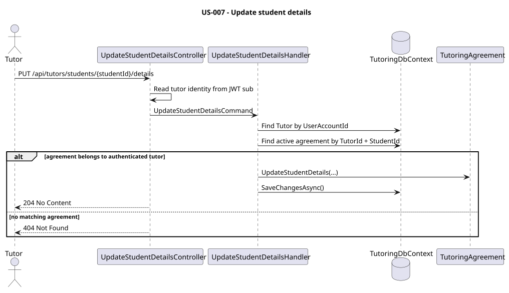

# US-007 — Store student subject, rate, contact details, and notes

> As a tutor, I want to store each student's subject, rate, contact details, and notes so that I have all key information in one place.

## Scope

A tutor can record and update cooperation-specific information for a student
they already work with. This data belongs to the `Tutor`↔`Student`
relationship — the `TutoringAgreement` — rather than to the `Student` entity
itself, because it is specific to a given tutor and a given student:
`Subject`, an optional `HourlyRate`, optional tutor-maintained contact
details (`ContactEmail`, `ContactPhoneNumber`), and optional `Notes`. In this
MVP, an agreement holds exactly one subject and one rate.

## API

| Method | Endpoint | Auth | Result |
| --- | --- | --- | --- |
| PUT | `/api/tutors/students/{studentId}/details` | `Tutor` role | Updates the active `TutoringAgreement` between the caller and the student, returns `204 No Content`. |

## Implementation

- `UpdateStudentDetailsHandler` resolves the tutor from the `sub` claim (`404 Tutors.NotFound` if missing), then looks up the active (non-`Ended`) `TutoringAgreement` for that `TutorId` + `StudentId` pair (`404 TutoringAgreements.NotFound` if none exists or it belongs to a different tutor). The `TutorId` is never taken from the request body, so a tutor can only ever modify their own agreements.
- The domain update happens through `TutoringAgreement.UpdateStudentDetails(...)`, not by setting properties directly from the handler, keeping the invariant enforcement inside the aggregate.
- `Subject` is required; `HourlyRate`, `ContactEmail`, `ContactPhoneNumber`, and `Notes` are all optional and can be cleared by sending `null` (or, for `Notes`, an empty/whitespace string).
- `HourlyRate` reuses the existing `Money` value object, which rejects negative amounts (`400` via the domain's `ArgumentOutOfRangeException` mapping).
- `ContactEmail` and `ContactPhoneNumber` reuse the existing `EmailAddress` and `PhoneNumber` value objects and are independent of the student's own `UserAccount` contact data — they do not replace it.

## Diagram

## Tests

`Tutoring.IntegrationTests.Features.Tutors.UpdateStudentDetails.UpdateStudentDetailsTests`: authorization check, successful update of `Subject`, `HourlyRate`, `ContactEmail`, `ContactPhoneNumber`, and `Notes`, updating previously saved values, clearing optional fields back to `null`, rejection of a negative `HourlyRate`, agreement belonging to another tutor, missing student/agreement, and visibility of the updated data through `GET /api/tutors/me/students`.

`Tutoring.UnitTest.TutoringAgreements.TutoringAgreementTest`: `UpdateStudentDetails` updates the agreement's owned student data, and `Money` rejects a negative hourly rate.
