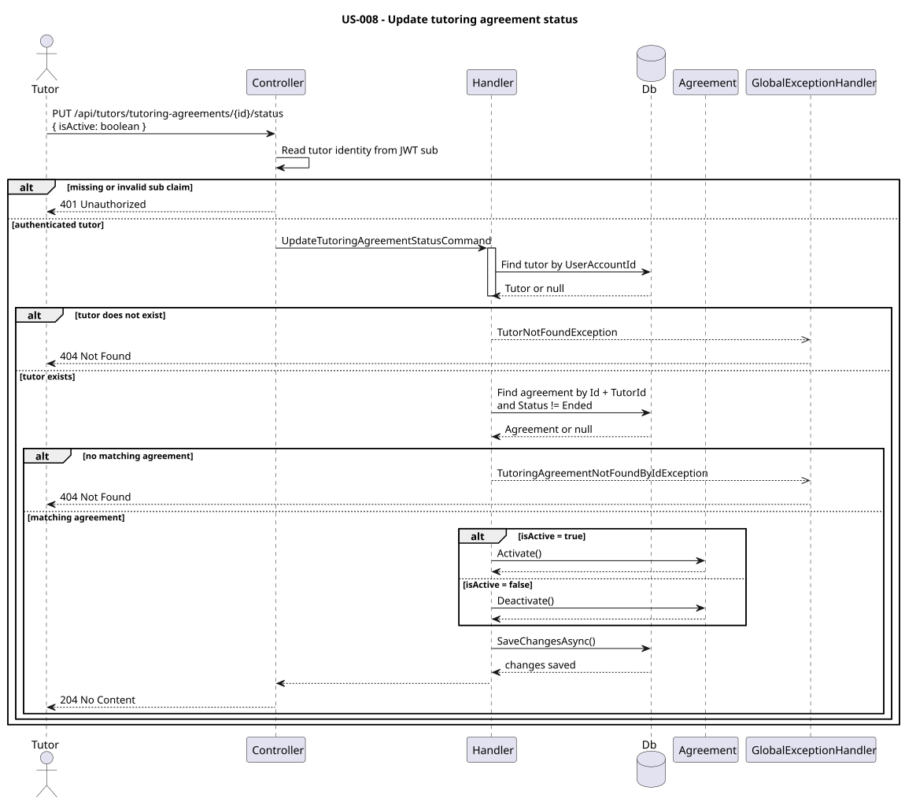

# US-008 — Update tutoring agreement status

> As a tutor, I want to mark a tutoring agreement with a student as active or inactive so that I can manage whether that specific teaching relationship is currently active.

## Scope

This endpoint manages the lifecycle of a single `TutoringAgreement`. A tutor may have multiple agreements with the same student, so the status belongs to the agreement itself rather than to the `Student` aggregate. Only the owning tutor can change the agreement state; a closed agreement (`Ended`) cannot be reopened or suspended through this API, and the student/tutor profiles remain untouched by this operation.

## FILES

- Implementation: [UpdateTutoringAgreementStatus](../../../../../TutoringManagementSystem/Tutoring.Api/Features/Tutors/UpdateTutoringAgreementStatus/)
- Tests: [integration tests](../../../../../TutoringManagementSystem/Tutoring.IntegrationTests/Features/Tutors/UpdateTutoringAgreementStatus/), [domain unit tests](../../../../../TutoringManagementSystem/Tutoring.UnitTest/TutoringAgreements/)

## API

| Method | Endpoint | Auth | Result |
| --- | --- | --- | --- |
| PUT | `/api/tutors/tutoring-agreements/{tutoringAgreementId}/status` | `Tutor` role | Updates the agreement status and returns `204 No Content`. |

Request body:

```json
{
  "isActive": true
}
```

`true` resolves to `AgreementStatus.Active`; `false` resolves to `AgreementStatus.Suspended`.

## Implementation

- `UpdateTutoringAgreementStatusController` reads the current user from the `sub` claim and rejects invalid or missing values with `401 Unauthorized`.
- The controller is guarded by `[Authorize(Roles = "Tutor")]`, so callers without the `Tutor` role receive `403 Forbidden`.
- `UpdateTutoringAgreementStatusHandler` resolves the authenticated tutor by `UserAccountId` and then loads the target agreement by `TutoringAgreementId`, `TutorId == current tutor Id`, and `Status != AgreementStatus.Ended`.
- If the tutor account is missing, the handler throws `TutorNotFoundException` and the API returns `404 Not Found`.
- If the agreement is missing, belongs to another tutor, or is already `Ended`, the handler throws `TutoringAgreementNotFoundByIdException`, which is surfaced as `404 Not Found`.
- The actual state transition is delegated to the aggregate: `agreement.Activate()` sets status to `Active`, and `agreement.Deactivate()` sets status to `Suspended`.
- Both domain methods reject `Ended` agreements through `TutoringAgreementEndedException`, keeping the invariant inside the aggregate rather than in the controller or handler.
- The mutation is persisted with `SaveChangesAsync` after the aggregate update.

## Diagram



## Tests

`Tutoring.IntegrationTests.Features.Tutors.UpdateTutoringAgreementStatus.UpdateTutoringAgreementStatusTests`: unauthorized request, student forbidden, active agreement suspended, suspended agreement activated, agreement owned by another tutor returns `404`, and non-existent agreement returns `404`.
