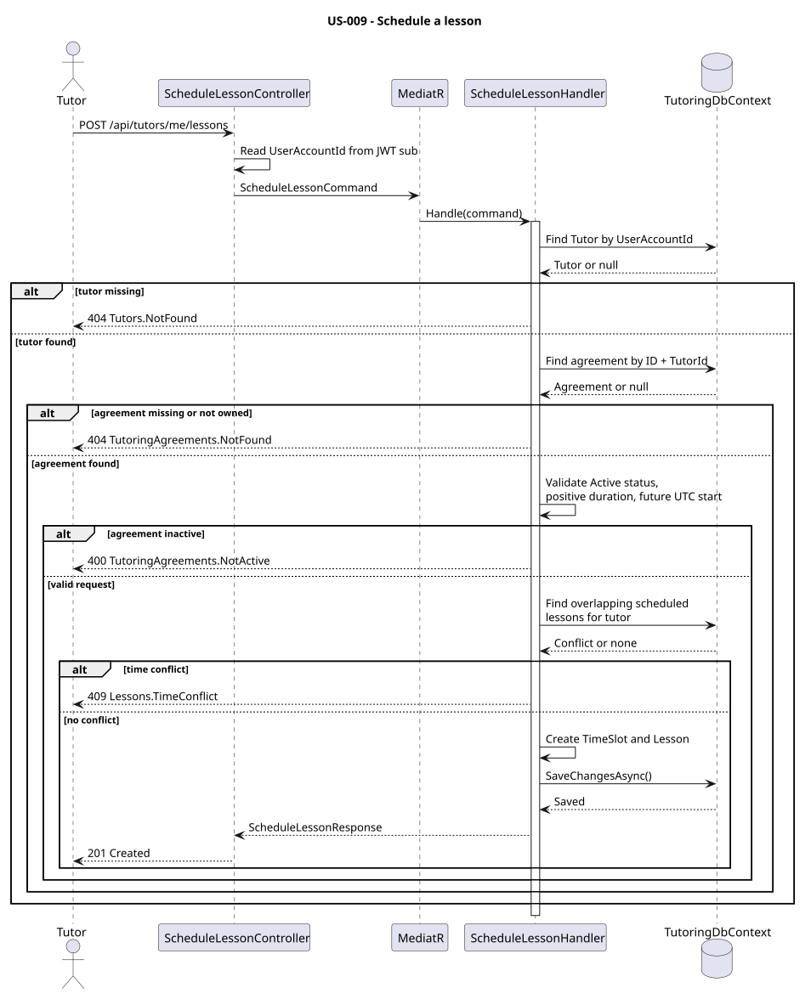

# US-009 — Schedule a lesson

> As a tutor, I want to schedule a lesson with a date, student, subject, and duration so that I can plan tutoring sessions.

## Scope

An authenticated tutor can schedule one future lesson within an active `TutoringAgreement` they own. The lesson stores the agreement and its time slot; the student and subject are obtained through the agreement rather than duplicated on `Lesson`.

Only positive durations are accepted. Scheduled lessons for the same tutor cannot overlap, while adjacent time slots are allowed. US-009 creates standalone lessons only, so `LessonSeriesId` is `null`; recurring lesson schedules belong to US-035.

## API

| Method | Endpoint | Auth | Result |
| --- | --- | --- | --- |
| POST | `/api/tutors/me/lessons` | `Tutor` role | Creates a standalone lesson and returns `201 Created`. |

Request body:

```json
{
  "tutoringAgreementId": "73c2ea16-63b2-4bc3-b97b-57bf58fc15bb",
  "startsAt": "2026-10-10T18:00:00+02:00",
  "durationMinutes": 60
}
```

Response body:

```json
{
  "lessonId": "..."
}
```

## Implementation

- `ScheduleLessonController` requires the `Tutor` role and obtains the authenticated `UserAccountId` from the `sub` claim.
- `ScheduleLessonHandler` resolves the `Tutor` by `UserAccountId`, then queries the agreement by both ID and tutor ID. Missing tutors return `404` with `Tutors.NotFound`; missing or unowned agreements return `404` with `TutoringAgreements.NotFound`.
- Only `AgreementStatus.Active` is accepted; inactive agreements return `400` with `TutoringAgreements.NotActive`.
- `TimeProvider` supplies the current UTC time. `StartsAt` is converted to UTC, must be in the future, and `EndsAtUtc` is calculated from `DurationMinutes`; invalid durations or past starts return `400` with `Request.Invalid`.
- Conflicts are checked only against `LessonStatus.Scheduled` lessons of the same tutor using `existing.Start < new.End` and `existing.End > new.Start`. Touching boundaries do not conflict; conflicts return `409` with `Lessons.TimeConflict`.
- A `Lesson` is created with `LessonStatus.Scheduled`, no `LessonSeriesId`, and persisted with `SaveChangesAsync`.

## Diagram



## Tests

`Tutoring.IntegrationTests.Features.Tutors.ScheduleLesson.ScheduleLessonTests`: successful standalone lesson persistence and UTC conversion, authorization, agreement ownership and suspended-status validation, invalid duration and past-date validation, all overlap directions, back-to-back scheduling, and independent schedules for different tutors.
