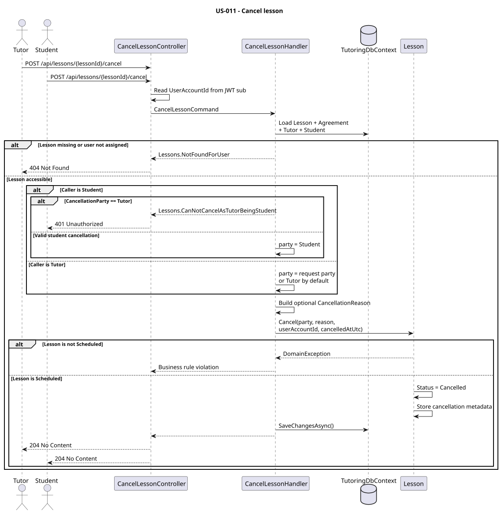

# US-011 — Cancel a lesson

> As a tutor or student, I want to cancel a scheduled lesson and optionally provide a reason so that the cancellation is documented.

## Scope

An authenticated tutor or student can cancel a scheduled lesson that belongs to their `TutoringAgreement`.

Cancellation stores who cancelled the lesson from the business perspective (`Tutor` or `Student`), which authenticated user recorded the cancellation, when it was cancelled, and an optional reason.

This distinction allows a tutor to record a cancellation on behalf of a student who does not use the application and therefore has no linked `UserAccount`.

Only lessons with `LessonStatus.Scheduled` can be cancelled.

## FILES

- Implementation: [CancelLesson](../../../../../TutoringManagementSystem/Tutoring.Api/Features/Lessons/CancelLesson/)
- Exceptions: [Lessons exceptions](../../../../../TutoringManagementSystem/Tutoring.Api/Features/Lessons/Exceptions/)
- Domain: [Lessons](../../../../../TutoringManagementSystem/Tutoring.Domain/Lessons/)
- Tests: [CancelLesson](../../../../../TutoringManagementSystem/Tutoring.IntegrationTests/Features/Lessons/CancelLesson/)

## API

| Method | Endpoint | Auth | Result |
| --- | --- | --- | --- |
| POST | `/api/lessons/{lessonId}/cancel` | `Tutor` or `Student` role | Cancels a scheduled lesson and returns `204 No Content`. |

Request body:

```json
{
  "cancellationParty": "Student",
  "reason": "Cannot attend"
}
```

Both fields are optional.

If a student performs the request, the cancellation party is always `Student`. A student cannot record the cancellation as being caused by the tutor.

If a tutor performs the request, `cancellationParty` can be either `Tutor` or `Student`. When omitted, it defaults to `Tutor`.

`reason` is optional. A missing, empty, or whitespace-only reason is stored as `null`.

## Implementation

- `CancelLessonController` allows both `Tutor` and `Student` roles and obtains the authenticated `UserAccountId` from the JWT `sub` claim.
- `CancelLessonHandler` loads the lesson together with its `TutoringAgreement`, tutor, and student.
- The lesson is accessible only when the authenticated account belongs to either the tutor or the student assigned through the agreement. Missing or inaccessible lessons return `404` with `Lessons.NotFoundForUser`.
- For an authenticated student, `LessonCancellationParty.Student` is assigned automatically. Attempting to submit `LessonCancellationParty.Tutor` returns `401 Unauthorized` with `Lessons.CanNotCancelAsTutorBeingStudent`.
- For an authenticated tutor, the requested cancellation party is used. If it is omitted, `Tutor` is used by default.
- This allows a tutor to record `Student` as the cancellation party even when the student has no `UserAccount`, for example when a manually managed student informs the tutor outside the application.
- `CancellationReason` is optional and is created only when a non-empty reason is provided.
- `Lesson.Cancel(...)` owns the state transition and allows cancellation only from `LessonStatus.Scheduled`.
- A successful cancellation changes the lesson status to `Cancelled` and stores `LessonCancellationParty`, optional `CancellationReason`, `CancelledAtUtc`, and `CancelledByUserAccountId`.
- `CancelledByUserAccountId` represents the authenticated application user who recorded the cancellation, while `LessonCancellationParty` represents who cancelled the lesson from the business perspective.
- The mutation is persisted using `SaveChangesAsync`.

## Cancellation metadata

| Field | Meaning |
| --- | --- |
| `LessonCancellationParty` | Whether the cancellation was caused by the tutor or student. |
| `CancellationReason` | Optional reason for the cancellation. |
| `CancelledAtUtc` | UTC timestamp when the cancellation was recorded. |
| `CancelledByUserAccountId` | `UserAccount` that recorded the cancellation in the application. |

Example for a managed student without an account:

```text
LessonCancellationParty = Student
CancelledByUserAccountId = Tutor.UserAccountId
CancellationReason = null
```

This means that the student cancelled the lesson, while the tutor recorded that information in the system.

## Diagram



## Tests

`Tutoring.IntegrationTests.Features.Lessons.CancelLesson.CancelLessonTests` covers tutor cancellation, student cancellation, tutor cancellation on behalf of a managed student without `UserAccount`, optional and whitespace reasons, missing lessons, access to another tutor's or student's lesson, unauthenticated requests, a student attempting to cancel as a tutor, and rejection of cancellation for lessons that are no longer `Scheduled`.