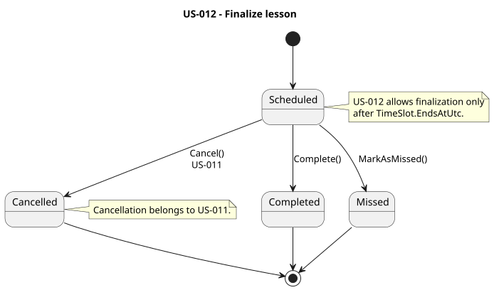

# US-012 — Mark lesson as completed or missed

> As a tutor, I want to mark a scheduled lesson as completed or missed so that the lesson history accurately reflects what happened.

## Scope

An authenticated tutor can finalize one of their scheduled lessons after its scheduled end time.

A lesson can be finalized as:

- `Completed` — the lesson took place.
- `Missed` — the lesson did not take place because it was missed.

Only lessons with `LessonStatus.Scheduled` can be finalized.

Lesson cancellation is not handled by this use case. Cancellations remain part of US-011 and use the dedicated cancellation endpoint and cancellation metadata.

## FILES

- Implementation: [SetLessonStatus](../../../../../TutoringManagementSystem/Tutoring.Api/Features/Tutors/SetLessonStatus/)
- Domain: [Lessons](../../../../../TutoringManagementSystem/Tutoring.Domain/Lessons/)
- Tests: [SetLessonStatus](../../../../../TutoringManagementSystem/Tutoring.IntegrationTests/Features/Tutors/SetLessonStatus/)

## API

| Method | Endpoint | Auth | Result |
| --- | --- | --- | --- |
| PUT | `/api/tutors/me/lessons/{lessonId}/status` | `Tutor` role | Marks a scheduled lesson as `Completed` or `Missed` and returns `204 No Content`. |

Request body:

```json
{
  "status": "Completed"
}
```

or:

```json
{
  "status": "Missed"
}
```

`Scheduled` and `Cancelled` are not valid target statuses for this endpoint.

## Business rules

A lesson can only transition from `Scheduled` to:

```text
Scheduled -> Completed
Scheduled -> Missed
```

`Completed`, `Missed`, and `Cancelled` are final states for this use case.

A lesson cannot be finalized before its scheduled end time.

A tutor can only finalize lessons belonging to one of their own `TutoringAgreement` records.

Cancellation is handled separately by US-011:

```text
Scheduled -> Cancelled
```

The status endpoint cannot be used to bypass the cancellation flow.

## Implementation

- `SetLessonStatusController` is restricted to the `Tutor` role.
- The authenticated `UserAccountId` is obtained from the JWT `sub` claim.
- `SetLessonStatusHandler` resolves the authenticated tutor and loads only a lesson owned by that tutor.
- Missing lessons and lessons owned by another tutor return `404` with `Lessons.LessonNotFound`.
- Only `Completed` and `Missed` are accepted as target statuses.
- `Scheduled` and `Cancelled` requests return `400 Bad Request`.
- `Lesson.Complete(...)` owns the transition from `Scheduled` to `Completed`.
- `Lesson.MarkAsMissed(...)` owns the transition from `Scheduled` to `Missed`.
- Both domain operations verify that the lesson is still `Scheduled`.
- Both domain operations verify that the lesson scheduled end time has already passed.
- Attempting to finalize a lesson before its end time returns `422` with `Lessons.CannotBeFinalizedBeforeEnd`.
- Attempting to modify an already finalized or cancelled lesson returns `422` with `Lessons.CannotBeFinalized`.
- Successful changes are persisted using `SaveChangesAsync`.

## Status lifecycle

```text
              -> Completed
Scheduled ----|
              -> Missed

Scheduled ------> Cancelled
                  US-011
```

US-012 owns only the `Completed` and `Missed` transitions.

US-011 owns the `Cancelled` transition.

## Diagram



## Tests

`Tutoring.IntegrationTests.Features.Tutors.SetLessonStatus.SetLessonStatusTests` covers:

- marking a scheduled lesson as `Completed`,
- marking a scheduled lesson as `Missed`,
- rejecting finalization before the lesson end time,
- rejecting changes to `Completed`, `Missed`, and `Cancelled` lessons,
- rejecting `Scheduled` and `Cancelled` as target statuses,
- missing lessons,
- lessons owned by another tutor,
- student access,
- unauthenticated requests.