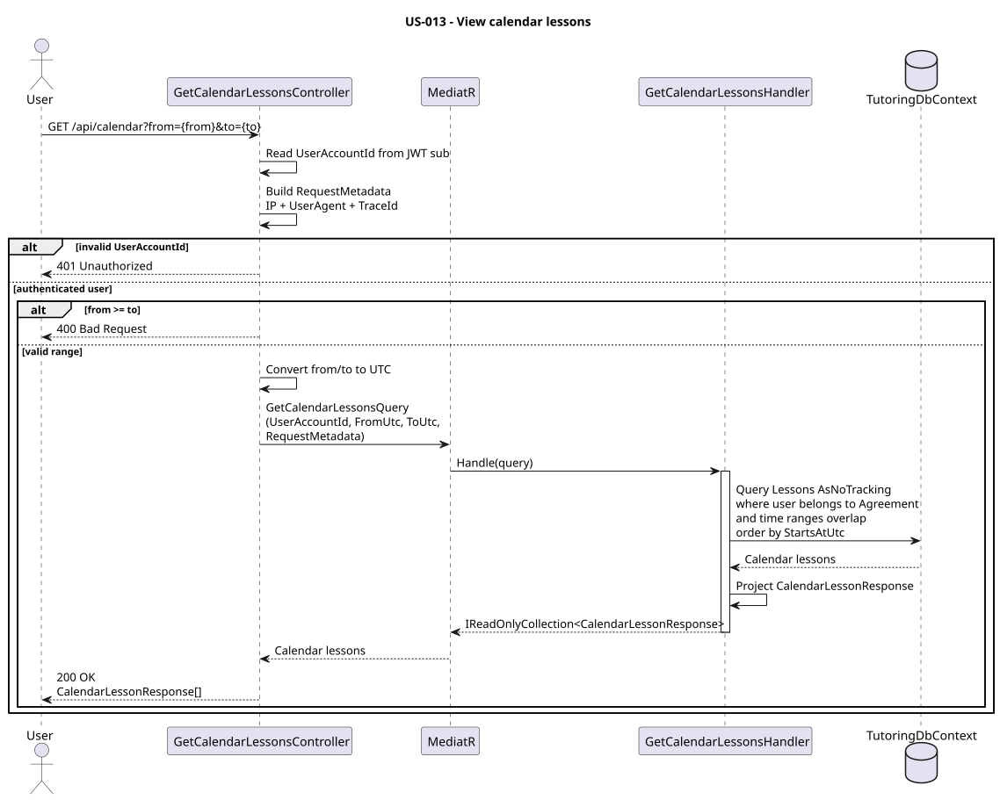

# US-013 — View calendar by day, week, and month

> As a user, I want daily, weekly, and monthly calendar views so that I can review my lesson schedule conveniently.

## Scope

An authenticated tutor or student can retrieve lessons belonging to them for a selected time range.

The backend does not contain separate `Day`, `Week`, or `Month` calendar modes. These are presentation concerns handled by the client.

The client calculates the required time range for the selected calendar view and sends the range to one common calendar endpoint.

Examples:

```text
Day:
2026-09-24 00:00
→ 2026-09-25 00:00

Week:
2026-09-21 00:00
→ 2026-09-28 00:00

Month:
2026-09-01 00:00
→ 2026-10-01 00:00
```

The API converts the supplied timestamps to UTC before querying lessons.

A lesson is included when its time slot overlaps the requested range.

## FILES

- Implementation: [GetCalendarLessons](../../../../../TutoringManagementSystem/Tutoring.Api/Features/Calendar/GetCalendarLessons/)
- Domain: [Lessons](../../../../../TutoringManagementSystem/Tutoring.Domain/Lessons/)
- Tests: [GetCalendarLessons](../../../../../TutoringManagementSystem/Tutoring.IntegrationTests/Features/Calendar/GetCalendarLessons/)

## API

| Method | Endpoint | Auth | Result |
| --- | --- | --- | --- |
| GET | `/api/calendar?from={from}&to={to}` | `Tutor` or `Student` role | Returns lessons belonging to the authenticated user that overlap the requested range. |

Example:

```http
GET /api/calendar?from=2026-09-21T00:00:00%2B02:00&to=2026-09-28T00:00:00%2B02:00
Authorization: Bearer {accessToken}
```

Query parameters:

| Parameter | Type | Description |
| --- | --- | --- |
| `from` | `DateTimeOffset` | Start of the requested calendar range. |
| `to` | `DateTimeOffset` | Exclusive end of the requested calendar range. |

The range follows `[from, to)` semantics.

`from` must be earlier than `to`. Invalid ranges return `400 Bad Request`.

Example response:

```json
[
  {
    "lessonId": "7e2906ef-9368-43c8-9eb4-a645462dcc08",
    "tutoringAgreementId": "73c2ea16-63b2-4bc3-b97b-57bf58fc15bb",
    "lessonSeriesId": null,
    "title": "Mathematics tutoring",
    "subject": "Mathematics",
    "startsAtUtc": "2026-09-24T16:00:00+00:00",
    "endsAtUtc": "2026-09-24T17:00:00+00:00",
    "status": "Scheduled",
    "studentId": "1e1cbab7-e4de-40fa-ad24-d33af715dc49",
    "studentDisplayName": "student",
    "tutorId": "db45b95d-da9b-45b2-a969-cad202dc88da",
    "tutorFirstName": "Tutor",
    "tutorLastName": "Test"
  }
]
```

## Implementation

- `GetCalendarLessonsController` accepts authenticated users with either the `Tutor` or `Student` role.
- The authenticated `UserAccountId` is obtained from the JWT `sub` claim.
- `GetCalendarLessonsRequest` contains the `From` and `To` values received through the query string.
- The controller validates that `From < To`.
- Both timestamps are converted to UTC before creating `GetCalendarLessonsQuery`.
- One endpoint is used for daily, weekly, and monthly calendar views.
- `GetCalendarLessonsHandler` filters lessons by the authenticated user's relationship with the lesson's `TutoringAgreement`.
- A tutor can see lessons from agreements assigned to that tutor.
- A registered student can see lessons from agreements assigned to that student.
- Managed students without a linked `UserAccount` cannot directly authenticate and therefore do not request their own calendar.
- Lessons belonging only to other tutors or students are excluded.
- Results are ordered by `StartsAtUtc`.
- Calendar retrieval is read-only and uses `AsNoTracking()`.

## Range overlap

A lesson is returned when:

```text
lesson.StartsAtUtc < requested.ToUtc
AND
lesson.EndsAtUtc > requested.FromUtc
```

This intentionally checks interval overlap instead of checking only the lesson start time.

For example, for the requested range:

```text
10:00 → 11:00
```

the lesson:

```text
09:30 → 10:30
```

is included because it overlaps the beginning of the requested range.

Similarly:

```text
10:30 → 11:30
```

is included because it overlaps the end.

Boundary-only intervals are not included:

```text
09:00 → 10:00
```

does not overlap `[10:00, 11:00)`.

Likewise:

```text
11:00 → 12:00
```

does not overlap `[10:00, 11:00)`.

No lesson contents or other unnecessary user data are written to the logs.

## Calendar views

The backend is independent of calendar presentation.

The frontend is responsible for producing ranges for the selected view.

### Day

```text
from = selected day at 00:00
to   = next day at 00:00
```

### Week

```text
from = first day of displayed week at 00:00
to   = first day of next week at 00:00
```

### Month

```text
from = first day of displayed month at 00:00
to   = first day of next month at 00:00
```

This keeps calendar presentation rules outside the domain and allows the same API to support additional calendar views in the future.

## Diagram



Source:

```text
diagrams/get_calendar_lessons.puml
```

## Tests

`Tutoring.IntegrationTests.Features.Calendar.GetCalendarLessons.GetCalendarLessonsTests` covers:

- unauthenticated access,
- invalid date ranges,
- tutor calendar access,
- student calendar access,
- isolation between users,
- lessons overlapping the beginning of a range,
- lessons overlapping the end of a range,
- exclusive range boundaries,
- chronological ordering,
- daily ranges,
- weekly ranges,
- monthly ranges,
- lesson data returned by the calendar API.