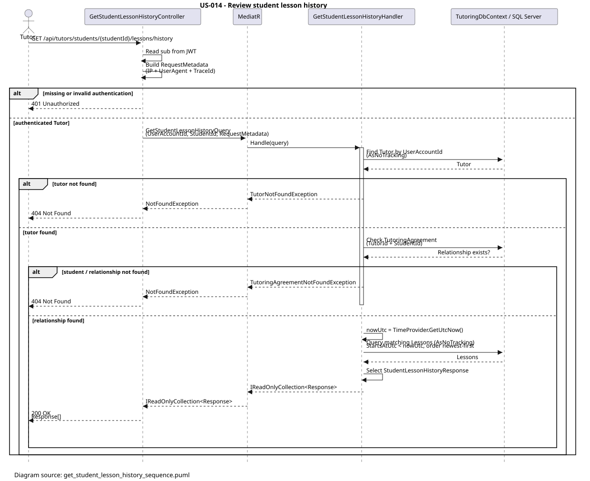

# [US-014] Review student lesson history

> As a tutor, I want to review a student's lesson history so that I can understand previous work with that student.

## Scope

An authenticated tutor can retrieve the lesson history for a specific student through a tutor-owned tutor–student relationship represented by `TutoringAgreement`.

The endpoint returns lessons whose `StartsAtUtc` is before the current UTC time. Results are ordered from newest to oldest and include lessons from all agreements between the authenticated tutor and the student. Future lessons are excluded. An ended agreement does not remove its existing lessons from the history, and a valid relationship with no historical lessons returns `200 OK` with an empty collection.

The tutor identity is taken from the JWT `sub` claim; the client cannot provide a tutor identifier. A student belonging to another tutor, or a student without a matching agreement, is not disclosed and produces `404 Not Found`.

## FILES

- Feature: [GetStudentLessonHistory](../../../../../TutoringManagementSystem/Tutoring.Api/Features/Tutors/GetStudentLessonHistory/)
- Controller: [GetStudentLessonHistoryController.cs](../../../../../TutoringManagementSystem/Tutoring.Api/Features/Tutors/GetStudentLessonHistory/GetStudentLessonHistoryController.cs)
- Integration tests: [GetStudentLessonHistoryTests.cs](../../../../../TutoringManagementSystem/Tutoring.IntegrationTests/Features/Tutors/GetStudentLessonHistory/GetStudentLessonHistoryTests.cs)
- Sequence diagram: [get_student_lesson_history_sequence.svg](diagrams/get_student_lesson_history_sequence.svg)

## API

| Method | Endpoint | Auth | Result |
| --- | --- | --- | --- |
| GET | `/api/tutors/students/{studentId}/lessons/history` | JWT, `Tutor` role | Returns the authenticated tutor's historical lessons for the route student and responds with `200 OK`. |

The request has no body. `studentId` is supplied in the route. The authenticated tutor is identified by the JWT `sub` claim.

### Response

```json
[
  {
    "lessonId": "4b8c5b52-1d4e-4e80-9f3a-2c1b1a7d6e90",
    "tutoringAgreementId": "c5d4e3f2-a1b0-49c8-87d6-5e4f3a2b1c00",
    "startsAtUtc": "2026-08-14T16:00:00+00:00",
    "endsAtUtc": "2026-08-14T17:00:00+00:00",
    "status": "Completed",
    "subject": "Physics",
    "agreementTitle": "Weekly physics tutoring",
    "cancellationReason": null
  }
]
```

Each item is a `StudentLessonHistoryResponse` containing:

| Field | Type | Description |
| --- | --- | --- |
| `lessonId` | `Guid` | Lesson identifier. |
| `tutoringAgreementId` | `Guid` | Agreement owning the lesson. |
| `startsAtUtc` | `DateTimeOffset` | Lesson start time in UTC. |
| `endsAtUtc` | `DateTimeOffset` | Lesson end time in UTC. |
| `status` | `string` | Current `LessonStatus` value. |
| `subject` | `string` | Subject from the agreement. |
| `agreementTitle` | `string` | Title from the agreement. |
| `cancellationReason` | `string?` | Cancellation reason, or `null` when absent. |

## Implementation

- `GetStudentLessonHistoryController` is restricted to the `Tutor` role by `[Authorize(Roles = "Tutor")]`.
- The controller reads `sub` from the JWT, creates `RequestMetadata` containing the request IP, user agent, and trace identifier, and sends `GetStudentLessonHistoryQuery` through MediatR. An unparseable `sub` returns `401 Unauthorized`.
- `GetStudentLessonHistoryHandler` resolves the `Tutor` by `UserAccountId`. A missing tutor raises `TutorNotFoundException`.
- Ownership is checked with `TutorId + StudentId` against `TutoringAgreement`. Missing ownership or a student without a matching agreement raises `TutoringAgreementNotFoundException`, which is exposed as `404 Not Found`.
- The handler uses `AsNoTracking()` for tutor, agreement, and lesson reads. It does not introduce a Repository, Service, or UnitOfWork abstraction; EF Core is used directly through `TutoringDbContext`.
- `TimeProvider.GetUtcNow()` defines the current time. Lessons are included when `lesson.TimeSlot.StartsAtUtc < nowUtc`; therefore future-starting lessons are excluded, while the filter is based on start time rather than end time.
- Lessons are filtered through their agreement, sorted by descending `StartsAtUtc`, and projected directly with `Select` into `StudentLessonHistoryResponse`. The projection includes the lesson status, agreement subject and title, and optional cancellation reason.
- The query spans every matching agreement for the tutor and student. Agreement status is not filtered, so lessons remain visible after an agreement has ended.
- Database operations use the request `CancellationToken`. Successful reads return `Ok(IReadOnlyCollection<StudentLessonHistoryResponse>)`, including an empty collection when no lesson matches.

## Errors

| Scenario | HTTP status | Problem details code |
| --- | --- | --- |
| Missing or invalid JWT authentication | `401 Unauthorized` | Middleware response, or no feature code for a missing token |
| JWT does not contain the `Tutor` role | `403 Forbidden` | Authorization response |
| JWT `sub` cannot be parsed as a `Guid` | `401 Unauthorized` | No exception code; returned directly by the controller |
| Tutor record cannot be resolved from `sub` | `404 Not Found` | `Tutors.NotFound` |
| Student does not exist or has no agreement with the tutor | `404 Not Found` | `TutoringAgreements.NotFound` |
| Student belongs to another tutor | `404 Not Found` | `TutoringAgreements.NotFound` |
| Valid tutor–student relationship with no historical lessons | `200 OK` | — |

`GlobalExceptionHandler` maps `NotFoundException` to `404` and includes the exception code in the Problem Details `code` extension.


## Diagram



Source:

```text
diagrams/get_student_lesson_history_sequence.puml
```

## Tests

`Tutoring.IntegrationTests.Features.Tutors.GetStudentLessonHistory.GetStudentLessonHistoryTests` verifies the feature through black-box integration tests:

- HTTP retrieval of past lessons and the expected response DTO values,
- newest-first ordering,
- exclusion of future-starting lessons,
- `200 OK` with an empty list for a valid relationship without past lessons,
- `404 Not Found` when the student belongs to another tutor,
- `404 Not Found` for an unknown student identifier,
- `401 Unauthorized` without an access token,
- `403 Forbidden` for a student caller,
- retention of history after ending an agreement,
- aggregation of lessons from multiple agreements between the same tutor and student.

Each scenario uses an HTTP request, the real ASP.NET Core pipeline, the test database, and the HTTP response; the handler is not mocked or invoked directly.
