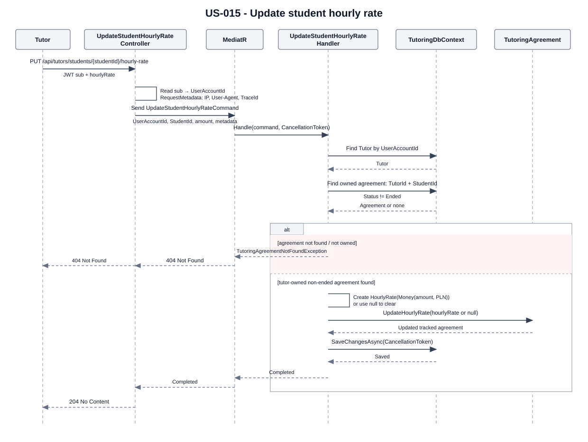

# [US-015] Define individual hourly rate

> As a tutor, I want to define an individual hourly rate for each student so that I can handle different cooperation terms.

## Scope

An authenticated tutor can set, change, or clear the hourly rate stored on the `TutoringAgreement` for their relationship with a student. In this application, `TutoringAgreement` represents the Tutor–Student cooperation relationship and stores its current terms; it is not a formal legal contract.


Currently, hourly rates are stored exclusively in PLN. The API does not expose currency selection; the backend assigns PLN automatically. This is a current implementation limitation, not a permanent assumption. Multi-currency support is outside the scope of US-015 and may be introduced in a future feature.

## FILES

- API feature: [UpdateStudentHourlyRate](../../../../../TutoringManagementSystem/Tutoring.Api/Features/Tutors/UpdateStudentHourlyRate/)
- Integration test location: `TutoringManagementSystem/Tutoring.IntegrationTests/Features/Tutors/UpdateStudentHourlyRate/` (not present in the current repository)
- Agreement domain object: [TutoringAgreement.cs](../../../../../TutoringManagementSystem/Tutoring.Domain/TutoringAgreements/TutoringAgreement.cs)
- Rate value object: [HourlyRate.cs](../../../../../TutoringManagementSystem/Tutoring.Domain/TutoringAgreements/HourlyRate.cs)
- Amount and currency value objects: [Money.cs](../../../../../TutoringManagementSystem/Tutoring.Domain/Billing/Money.cs), [Currency.cs](../../../../../TutoringManagementSystem/Tutoring.Domain/Billing/Currency.cs)

## API

| Method | Endpoint | Auth | Result |
| --- | --- | --- | --- |
| PUT | `/api/tutors/students/{studentId}/hourly-rate` | JWT, `Tutor` role | `204 No Content` |

The authenticated tutor is resolved from the JWT `sub` claim. The request body sets or clears the rate:

```json
{
  "hourlyRate": 120.00
}
```

Set `hourlyRate` to `null` to clear the current rate:

```json
{
  "hourlyRate": null
}
```

| Error | Cause |
| --- | --- |
| `400 Bad Request` | Invalid hourly rate, including a negative amount. Negative amounts produce Problem Details code `Request.Invalid`. |
| `401 Unauthorized` | Missing/invalid authentication or an unparseable JWT `sub`. |
| `403 Forbidden` | Authenticated user does not have the `Tutor` role. |
| `404 Not Found` | Tutor, student agreement, or an agreement owned by the authenticated tutor cannot be found. Not-found Problem Details codes are `Tutors.NotFound` and `TutoringAgreements.NotFound`. Ownership mismatch is returned as `404` so another tutor's relationship is not disclosed. |

## Implementation

- Flow: HTTP request → `UpdateStudentHourlyRateController` → `UpdateStudentHourlyRateCommand` → `UpdateStudentHourlyRateHandler` → `TutoringAgreement.UpdateHourlyRate(...)` → `TutoringDbContext.SaveChangesAsync(...)` → `204 No Content`.
- The controller obtains `UserAccountId` from JWT `sub` and creates `RequestMetadata` with the client IP, User-Agent, and trace identifier. It passes the request cancellation token through MediatR and uses structured logging; the handler also logs its not-found and successful update outcomes.
- The handler resolves the tutor by `UserAccountId`, then looks up the agreement using `TutorId + StudentId` and `Status != Ended`. This permits any non-ended status, including Draft or Suspended; ended agreements are excluded.
- The agreement is queried as a tracked EF entity because it is updated and persisted. The handler creates `HourlyRate(new Money(amount, new Currency("PLN")))`, or passes `null` to clear it, then saves changes with the `CancellationToken`.
- `Money` rejects negative amounts with `ArgumentOutOfRangeException`; `GlobalExceptionHandler` maps this to `400 Bad Request` with code `Request.Invalid`. Not-found exceptions are mapped to `404` with their respective codes.
- The rate is stored as embedded agreement data (`HourlyRateAmount` and `HourlyRateCurrencyCode`). This feature adds no table or migration, Repository, Service layer, Outbox, student approval workflow, or rate history.

## Tests

There is no `UpdateStudentHourlyRate` integration-test directory or test file in `Tutoring.IntegrationTests` in the current repository. Consequently, no integration-test coverage can be claimed for setting/changing/clearing a rate, validation, authorization, ownership/not-found behavior, or database state after success or failure.

## Diagram


