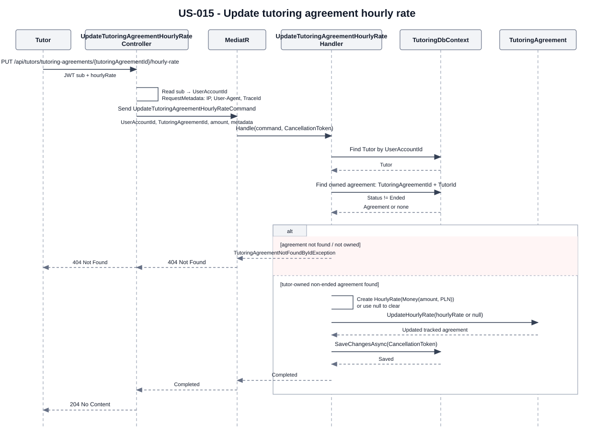

# [US-015] Define individual tutoring agreement hourly rate

> As a tutor, I want to define an hourly rate for a tutoring agreement so that each cooperation with a student can have its own pricing terms.

## Scope

An authenticated tutor can set, change, or clear the hourly rate stored on a `TutoringAgreement`. The rate belongs to the agreement, not to the `Student`, so each agreement can have its own pricing terms.

## FILES

- API feature: [UpdateTutoringAgreementHourlyRate](../../../../../TutoringManagementSystem/Tutoring.Api/Features/Tutors/UpdateTutoringAgreementHourlyRate/)
- Integration tests: [UpdateTutoringAgreementHourlyRateTests.cs](../../../../../TutoringManagementSystem/Tutoring.IntegrationTests/Features/Tutors/UpdateTutoringAgreementHourlyRate/UpdateTutoringAgreementHourlyRateTests.cs)
- Agreement domain object: [TutoringAgreement.cs](../../../../../TutoringManagementSystem/Tutoring.Domain/TutoringAgreements/TutoringAgreement.cs)
- Rate value object: [HourlyRate.cs](../../../../../TutoringManagementSystem/Tutoring.Domain/TutoringAgreements/HourlyRate.cs)
- Amount and currency value objects: [Money.cs](../../../../../TutoringManagementSystem/Tutoring.Domain/Billing/Money.cs), [Currency.cs](../../../../../TutoringManagementSystem/Tutoring.Domain/Billing/Currency.cs)

## API

| Method | Endpoint | Auth | Result |
| --- | --- | --- | --- |
| PUT | `/api/tutors/tutoring-agreements/{tutoringAgreementId}/hourly-rate` | JWT, `Tutor` role | `204 No Content` |

The authenticated tutor is resolved from the JWT `sub` claim. The `{tutoringAgreementId}` path parameter selects the agreement to update:

```json
{
  "hourlyRate": 120.00
}
```

Set `hourlyRate` to `null` to clear the current rate:

```json
{
  "hourlyRate": null
}
```

`null` clears the agreement's current rate. Currency is fixed to `PLN`; the request does not select a currency.

## Implementation

- The handler resolves the tutor from the JWT `sub`, then selects the tracked `TutoringAgreement` by `TutoringAgreementId`, the authenticated tutor's `TutorId`, and `Status != Ended`.
- An agreement that does not belong to the authenticated tutor is not exposed and results in `404 Not Found`.
- The handler creates `HourlyRate(new Money(amount, new Currency("PLN")))`, or passes `null` to `TutoringAgreement.UpdateHourlyRate(...)` to clear the rate, then persists the tracked agreement with `SaveChangesAsync`.
- Negative amounts are rejected by `Money` and mapped to `400 Bad Request`; missing tutors and agreements are mapped to `404 Not Found`.
- The rate is persisted as agreement data (`HourlyRateAmount` and `HourlyRateCurrencyCode`). No currency selection is exposed by this endpoint.

## Tests

`Tutoring.IntegrationTests`: setting, changing, clearing, and zero-valued rates; negative-rate validation with database preservation; missing, ended, and incorrectly owned agreements returning `404`; authentication and role authorization; and updating only the agreement selected by `TutoringAgreementId` when multiple agreements exist.

## Diagram


