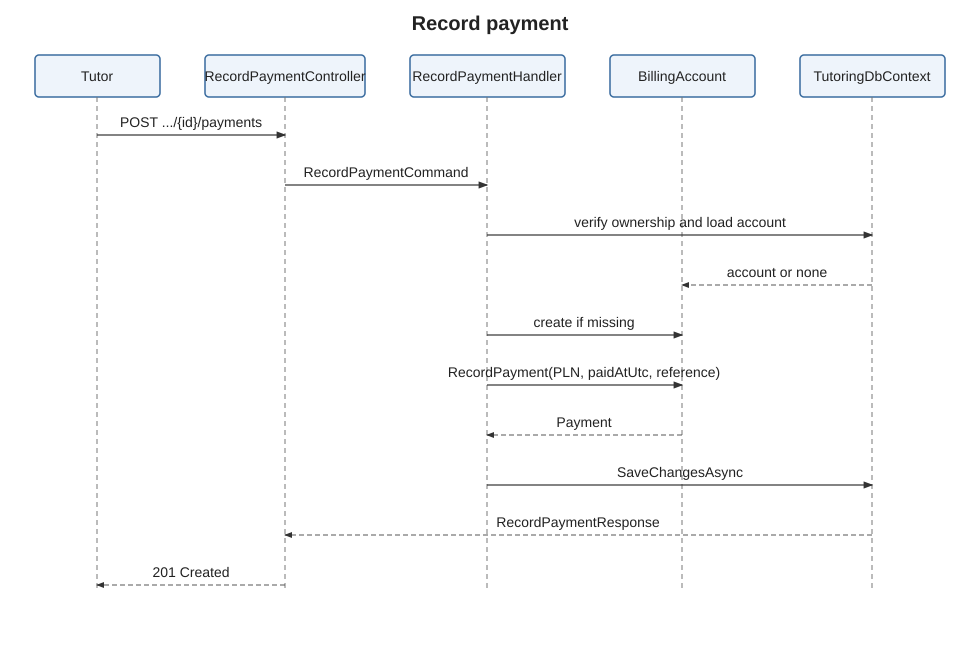

# US-017 — Record payment

> As a tutor, I want to record student payments so that I can keep payment records up to date.

## Scope

The tutor can manually register a payment received from a student for a
`TutoringAgreement`. The flow records the payment in the billing account
without contacting Stripe, Przelewy24, or any other payment provider.

The payment currency is currently always `PLN`. The endpoint does not attach a
payment directly to a lesson. Lesson receivables and received payments are
kept as separate entries under the same billing account.

## FILES

- API and application flow: [RecordPayment](../../../../../TutoringManagementSystem/Tutoring.Api/Features/Tutors/RecordPayment/)
- Billing aggregate: [BillingAccount.cs](../../../../../TutoringManagementSystem/Tutoring.Domain/Billing/BillingAccount.cs)
- Payment entity: [Payment.cs](../../../../../TutoringManagementSystem/Tutoring.Domain/Billing/Payment.cs)
- Lesson receivable: [LessonCharge.cs](../../../../../TutoringManagementSystem/Tutoring.Domain/Billing/LessonCharge.cs)
- Persistence mappings: [BillingAccountConfiguration.cs](../../../../../TutoringManagementSystem/Tutoring.Infrastructure/Persistence/Configurations/BillingAccountConfiguration.cs), [PaymentConfiguration.cs](../../../../../TutoringManagementSystem/Tutoring.Infrastructure/Persistence/Configurations/PaymentConfiguration.cs)
- Integration tests: [RecordPaymentTests.cs](../../../../../TutoringManagementSystem/Tutoring.IntegrationTests/Features/Tutors/RecordPayment/RecordPaymentTests.cs)
- Domain unit tests: [BillingAccountTest.cs](../../../../../TutoringManagementSystem/Tutoring.UnitTest/Billing/BillingAccountTest.cs)

## API

| Method | Endpoint | Auth | Result |
| --- | --- | --- | --- |
| POST | `/api/tutors/tutoring-agreements/{tutoringAgreementId}/payments` | Authenticated `Tutor` | `201 Created` with the recorded payment |

Request body:

```json
{
  "amount": 125.50,
  "paidAtUtc": "2026-10-02T18:30:00+00:00",
  "reference": "REF-001"
}
```

| Field | Type | Required | Description |
| --- | --- | --- | --- |
| `amount` | `decimal` | yes | Payment amount. It must be positive. |
| `paidAtUtc` | `DateTimeOffset` | yes | Time when the payment was received. |
| `reference` | `string` | no | Optional external or tutor-defined payment reference. |

The successful response contains `paymentId`, `amount`, `currency`, `paidAtUtc`,
and `reference`. `currency` is always `"PLN"`.

Important responses:

- `400 Bad Request` — invalid request data, including a negative amount.
- `401 Unauthorized` — no valid authentication or no usable user identity.
- `403 Forbidden` — the caller is authenticated but is not a tutor.
- `404 Not Found` — the tutoring agreement does not exist or is not owned by
  the authenticated tutor.
- `422 Unprocessable Entity` with code `Billing.PaymentNotPositive` — amount
  is zero.

## Business rules

- A tutor may record a payment only for a tutoring agreement owned by that
  tutor.
- Each tutoring agreement has at most one `BillingAccount`.
- If the agreement has no billing account, the flow creates one.
- If the billing account already exists, the flow reuses it.
- A `LessonCharge` represents an amount owed for a lesson.
- A `Payment` represents money received from the student.
- A payment is not assigned directly to a particular lesson.
- Both charges and payments are related through the same `BillingAccount`.
- The current implementation creates every payment in `PLN`; the request does
  not accept a currency.
- A positive amount is required. The domain rejects zero through
  `PaymentMustBePositiveException`; negative amounts are rejected by `Money`.

The model allows a later balance calculation based on:

```text
balance = sum(active lesson charges) - sum(payments)
```

## Implementation

- `RecordPaymentController` accepts only users with the `Tutor` role and
  returns `201 Created` after the command completes.
- `RecordPaymentHandler` first resolves the authenticated tutor and verifies
  ownership by querying the agreement with both its id and the tutor id.
- The handler loads the agreement's billing account, creates it when absent,
  and assigns it to the persistence context.
- The request amount is converted to `Money` with a `PLN` currency. An
  optional reference is converted to `PaymentReference`.
- `BillingAccount.RecordPayment(...)` validates the amount, creates the
  `Payment`, and adds it to the account.
- The billing account and payment are persisted together by
  `SaveChangesAsync`.
- The payment stores the billing account id, amount, receipt timestamp, and
  optional reference. No payment-provider call or asynchronous payment event is
  involved.

## Diagram



## Tests

### Integration tests

`Tutoring.IntegrationTests`: successful payment creation and persistence,
PLN response data, creation of a missing billing account, reuse of an existing
account, multiple payments for one account, non-positive amount validation,
missing or foreign tutoring agreements, unauthenticated access, and student
access being forbidden.

### Domain unit tests

`Tutoring.UnitTest`: payment creation with amount, timestamp, and optional
reference; rejection of zero amounts; rejection of negative amounts; and
ensuring invalid payments are not added to the billing account.
