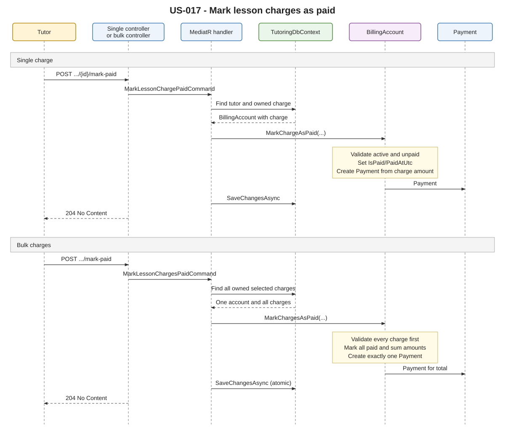

# [US-017] Mark lesson charges as paid

> As a tutor, I want to mark lesson charges as paid so that I can keep student payment records up to date.

## Scope

An authenticated tutor can mark one existing lesson charge or multiple existing lesson charges as paid. The amount is never supplied by the client: it is read from the selected `LessonCharge` records.

The billing account and lesson charges must already exist from the completed-lesson billing flow. This story does not create billing accounts, create lesson charges, support advance payments, or introduce payment allocation.

## FILES

- Single-charge API feature: [MarkLessonChargePaid](../../../../../TutoringManagementSystem/Tutoring.Api/Features/Tutors/MarkLessonChargePaid/)
- Bulk API feature: [MarkLessonChargesPaid](../../../../../TutoringManagementSystem/Tutoring.Api/Features/Tutors/MarkLessonChargesPaid/)
- Billing aggregate: [BillingAccount.cs](../../../../../TutoringManagementSystem/Tutoring.Domain/Billing/BillingAccount.cs)
- Lesson charge: [LessonCharge.cs](../../../../../TutoringManagementSystem/Tutoring.Domain/Billing/LessonCharge.cs)
- Payment entity: [Payment.cs](../../../../../TutoringManagementSystem/Tutoring.Domain/Billing/Payment.cs)
- Charge persistence mapping: [LessonChargeConfiguration.cs](../../../../../TutoringManagementSystem/Tutoring.Infrastructure/Persistence/Configurations/LessonChargeConfiguration.cs)
- Persistence migration: [20261004105243_MarkLessonChargesPaid.cs](../../../../../TutoringManagementSystem/Tutoring.Infrastructure/Persistence/Migrations/20261004105243_MarkLessonChargesPaid.cs)
- Domain tests: [BillingAccountTest.cs](../../../../../TutoringManagementSystem/Tutoring.UnitTest/Billing/BillingAccountTest.cs)
- Integration tests: [MarkLessonChargesPaidTests.cs](../../../../../TutoringManagementSystem/Tutoring.IntegrationTests/Features/Tutors/MarkLessonChargesPaid/MarkLessonChargesPaidTests.cs)

## API

| Method | Endpoint | Auth | Result |
| --- | --- | --- | --- |
| POST | `/api/tutors/me/lesson-charges/{lessonChargeId}/mark-paid` | JWT, `Tutor` role | `204 No Content` |
| POST | `/api/tutors/me/lesson-charges/mark-paid` | JWT, `Tutor` role | `204 No Content` |

### Single charge request

```json
{
  "paidAtUtc": "2026-10-04T11:00:00+00:00",
  "reference": "TRANSFER-001"
}
```

### Bulk charge request

```json
{
  "lessonChargeIds": [
    "00000000-0000-0000-0000-000000000001",
    "00000000-0000-0000-0000-000000000002"
  ],
  "paidAtUtc": "2026-10-04T11:00:00+00:00",
  "reference": "TRANSFER-001"
}
```

`reference` is optional. Neither request accepts an amount. The single payment uses the selected charge amount; the bulk payment uses the sum of all selected charge amounts.

## Business rules

- Only an authenticated tutor can mark charges as paid.
- A charge must belong to a billing account owned by the authenticated tutor.
- The billing account and all selected charges must already exist.
- A charge must have `ChargeStatus.Active` and must not already be paid.
- Payment state is separate from the existing charge lifecycle state.
- Paid charges store `IsPaid = true` and the supplied `PaidAtUtc`.
- A single operation creates one `Payment` using exactly `LessonCharge.Amount`.
- A bulk operation creates exactly one `Payment` equal to the sum of selected charge amounts.
- All bulk charges must belong to the same `BillingAccount`.
- Bulk charge IDs must be non-empty and unique.
- All bulk charges are validated before any state is changed.
- Payment currencies must match across selected charges.
- No payment allocation entity is created by this story.

## Implementation

- The controllers require the `Tutor` role and read `UserAccountId` from the JWT `sub` claim.
- The single handler loads a billing account with the requested charge and verifies ownership through the tutoring agreement's `TutorId`.
- The bulk handler loads all owned billing accounts containing selected charges and rejects missing, foreign, or cross-account selections.
- `BillingAccount.MarkChargeAsPaid(...)` and `BillingAccount.MarkChargesAsPaid(...)` contain the main business operation.
- The aggregate validates active/unpaid state, updates `IsPaid` and `PaidAtUtc`, and creates the associated `Payment`.
- Bulk payment amount is calculated from the selected charges inside the aggregate; the request cannot override it.
- Each handler calls `SaveChangesAsync` once after the domain operation. EF Core persists the charge state and payment together.
- The development seed uses the aggregate operation to mark its seeded charge as paid.

## Error behavior

- `401 Unauthorized` — missing or invalid authentication.
- `403 Forbidden` — authenticated user does not have the `Tutor` role.
- `404 Not Found` with `Billing.LessonChargeNotFound` — charge does not exist or is not owned by the tutor.
- `409 Conflict` with `Billing.LessonChargesFromDifferentBillingAccounts` — bulk selection spans multiple billing accounts.
- `400 Bad Request` — empty or duplicate bulk IDs, invalid reference, or malformed request data.
- `422 Unprocessable Entity` with `Billing.ChargeCannotBePaid` — charge is inactive or already paid.

## Diagram



PlantUML source: [mark_lesson_charges_paid.puml](diagrams/mark_lesson_charges_paid.puml)

## Tests

### Unit tests

[BillingAccountTest.cs](../../../../../TutoringManagementSystem/Tutoring.UnitTest/Billing/BillingAccountTest.cs) covers:

- initial unpaid charge state,
- single-charge payment creation using the exact charge amount,
- `IsPaid` and `PaidAtUtc` updates,
- bulk payment creation with one payment for the total,
- marking all selected charges as paid,
- rejection of an already-paid charge,
- rejection of duplicate charge IDs,
- preservation of other charges and payments when bulk validation fails.

Result: the targeted billing domain test run passes **6/6 tests**.

### Integration tests

[MarkLessonChargesPaidTests.cs](../../../../../TutoringManagementSystem/Tutoring.IntegrationTests/Features/Tutors/MarkLessonChargesPaid/MarkLessonChargesPaidTests.cs) covers:

- single-charge `204` response and persisted payment/charge state,
- bulk `204` response and one payment for the summed amount,
- rejection of charges from different billing accounts without changing charge state,
- rejection of an already-paid charge without creating a second payment,
- tutor ownership protection,
- unauthenticated access.

The integration test project compiles successfully. Test execution is currently blocked because the repository fixture uses Testcontainers SQL Server and Docker is unavailable in the environment (`npipe://./pipe/docker_engine`).
