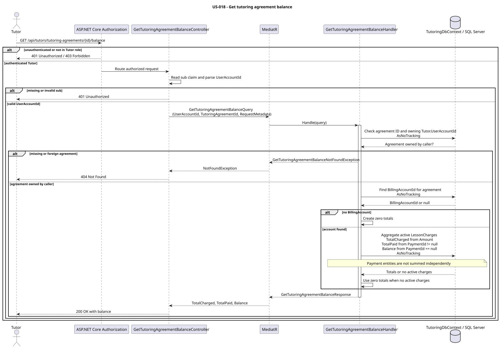

# US-018 — View tutoring agreement balance

> As a tutor, I want to see the balance of a tutoring agreement so that I know what has been paid and what is still due.

## Scope

This backend read-only feature returns the charged, paid, and outstanding amounts for one tutoring agreement. It does not change charges or payments, and does not introduce a separate payment-allocation model.

## Files

- API feature: [GetTutoringAgreementBalance](../../../../../TutoringManagementSystem/Tutoring.Api/Features/Tutors/GetTutoringAgreementBalance/)
- Integration tests: [GetTutoringAgreementBalanceTests.cs](../../../../../TutoringManagementSystem/Tutoring.IntegrationTests/Features/Tutors/GetTutoringAgreementBalance/GetTutoringAgreementBalanceTests.cs)
- Source billing entities: [LessonCharge.cs](../../../../../TutoringManagementSystem/Tutoring.Domain/Billing/LessonCharge.cs), [BillingAccount.cs](../../../../../TutoringManagementSystem/Tutoring.Domain/Billing/BillingAccount.cs)

## API

| Method | Endpoint | Authorization | Result |
| --- | --- | --- | --- |
| GET | `/api/tutors/tutoring-agreements/{tutoringAgreementId}/balance` | Authenticated user with the `Tutor` role | `200 OK` |

Example response:

```json
{
  "totalCharged": 75.50,
  "totalPaid": 45.50,
  "balance": 30.00
}
```

## Balance rules

The agreement's `BillingAccount` and its `LessonCharge` entities are the source of truth. Only charges with `ChargeStatus.Active` participate:

```text
TotalCharged = sum(Amount for active charges)
TotalPaid    = sum(Amount for active charges with PaymentId != null)
Balance      = sum(Amount for active charges with PaymentId == null)
```

For the current model, `Balance = TotalCharged - TotalPaid`; advance and partial payments are not supported. Payment state is determined from each charge's `PaymentId`, not by independently summing `Payment` entities.

If the agreement exists but has no `BillingAccount`, all three values are zero. An account with no active charges also returns zero totals.

## Authorization and errors

- The controller requires authentication and the `Tutor` role, then converts the JWT `sub` claim to `UserAccountId`.
- The handler verifies that the agreement belongs to the authenticated tutor before reading its billing data.
- `401 Unauthorized` — the caller is not authenticated or has no valid `sub` claim.
- `403 Forbidden` — the caller is authenticated but does not have the `Tutor` role.
- `404 Not Found` — the agreement does not exist or belongs to another tutor; both cases have the same result.

## Implementation

The handler uses no-tracking EF Core queries and aggregates active charge amounts in the database. This use case is read-only and requires no persistence schema changes or migration.

## Diagram



PlantUML source: [get_tutoring_agreement_balance.puml](diagrams/get_tutoring_agreement_balance.puml)

## Tests

`GetTutoringAgreementBalanceTests` covers:

- totals from paid and unpaid active charges,
- exclusion of inactive charges and an unlinked payment,
- isolation from charges belonging to another agreement,
- zero totals when the billing account is absent,
- identical `404 Not Found` behavior for a missing or foreign agreement,
- unauthenticated and non-tutor access.
