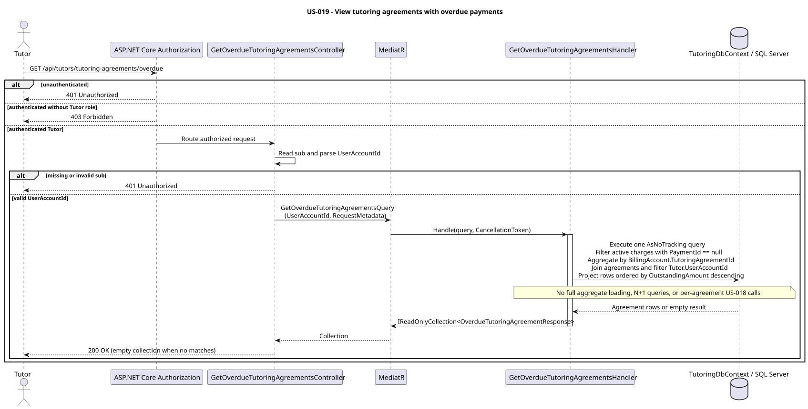

# US-019 — View students with overdue payments

> As a tutor, I want to see students with overdue payments so that I can react to unpaid lessons.

## Scope

This read-only endpoint returns one row per tutoring agreement that has at least one active, unpaid lesson charge. A student with overdue charges under multiple agreements appears once for each agreement.

The current model has no payment due date. For this use case, an active charge without a linked payment is therefore treated as overdue; no age or due-date threshold is applied.

## Files

- API feature: [GetOverdueTutoringAgreements](../../../../../TutoringManagementSystem/Tutoring.Api/Features/Tutors/GetOverdueTutoringAgreements/)
- Integration tests: [GetOverdueTutoringAgreementsTests.cs](../../../../../TutoringManagementSystem/Tutoring.IntegrationTests/Features/Tutors/GetOverdueTutoringAgreements/GetOverdueTutoringAgreementsTests.cs)
- Billing source entities: [LessonCharge.cs](../../../../../TutoringManagementSystem/Tutoring.Domain/Billing/LessonCharge.cs), [BillingAccount.cs](../../../../../TutoringManagementSystem/Tutoring.Domain/Billing/BillingAccount.cs)

## API

| Method | Endpoint | Authorization | Result |
| --- | --- | --- | --- |
| GET | `/api/tutors/tutoring-agreements/overdue` | Authenticated user with the `Tutor` role | `200 OK` |

The controller resolves `UserAccountId` from the JWT `sub` claim and passes request metadata with the MediatR query.

Example response:

```json
[
  {
    "tutoringAgreementId": "c4c967c8-1f3b-4055-9fd5-9cddfabc05d6",
    "studentId": "5d74645a-ae7e-43b9-88c7-7a1a85cc78de",
    "studentDisplayName": "Alex Student",
    "subject": "Mathematics",
    "agreementTitle": "Algebra tutoring",
    "outstandingAmount": 120.00,
    "unpaidLessonCount": 2
  }
]
```

An empty result is returned as `200 OK` with `[]`; it is not a `404`.

## Overdue charge rules

A charge is included only when both conditions hold:

```text
LessonCharge.Status == ChargeStatus.Active
LessonCharge.PaymentId == null
```

For each tutoring agreement:

```text
OutstandingAmount = sum(Amount for active charges without a payment)
UnpaidLessonCount = count(active charges without a payment)
```

Cancelled charges, corrected charges, and charges linked to a payment are excluded. Agreement status is not used as a filter, so suspended and ended agreements remain in the result if they have active unpaid charges. Rows are sorted by `OutstandingAmount` descending.

## Authorization and persistence

- `401 Unauthorized` — unauthenticated request or missing/invalid `sub` claim.
- `403 Forbidden` — authenticated caller without the `Tutor` role.
- Agreements are filtered to the tutor resolved from the caller's `UserAccountId`.
- The handler performs a single no-tracking EF Core query that aggregates charges by agreement and joins the agreement data. It does not load full aggregates, issue per-agreement queries, or call US-018.
- `OutstandingAmount` is calculated for the response only; no overdue flag or amount is persisted.
- No domain or database schema changes, due-date fields, or migrations are required.

## Tests

`GetOverdueTutoringAgreementsTests` covers aggregation and sorting per agreement, paid/cancelled/corrected charge exclusion, foreign tutor exclusion, suspended and ended agreements, empty results, and authentication/role authorization.

## Diagram



PlantUML source: [get_overdue_tutoring_agreements.puml](diagrams/get_overdue_tutoring_agreements.puml)