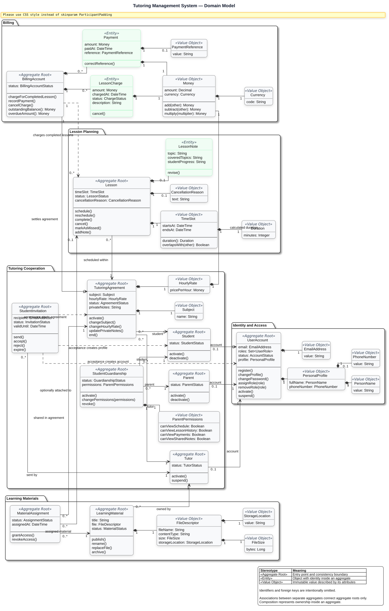

# User Stories - Tutoring Management System

Source: original project PDF brief.

## Priorities

| Priority | Meaning | Source Scope |
| --- | --- | --- |
| P1 | MVP, features required for the system to be useful | Required features |
| P2 | Important extensions after the MVP | Optional features |
| P3 | Future-oriented or experimental extensions | Highly optional features |

## Related Diagrams

### Domain Model

### User Use Cases

### Tutor Use Cases

### Student Use Cases

### Parent Use Cases

### Administrator Use Cases

## P1 - MVP

| ID | Module | User Story |
| --- | --- | --- |
| US-001 | Users | As a new user, I want to create an account as a tutor or student so that I can start using the system. |
| US-002 | Users | As a user, I want to sign in and sign out so that I can securely access my account. |
| US-003 | Users | As an administrator, I want the system to distinguish tutor, student, and administrator roles so that each person has the right level of access. |
| US-004 | Users | As a user, I want to edit my profile data and password so that my account information stays up to date. |
| US-005 | Students | As a tutor, I want to see my assigned students so that I can manage the people I teach. |
| US-006 | Students | As a tutor, I want to add a student manually or by invitation so that I can start working with them in the system. |
| US-007 | Students | As a tutor, I want to store each student's subject, rate, contact details, and notes so that I have all key information in one place. |
| US-008 | Students | As a tutor, I want to mark a student as active or inactive so that my student list reflects current cooperation. |
| US-009 | Calendar | As a tutor, I want to schedule a lesson with a date, student, subject, and duration so that I can plan tutoring sessions. |
| US-010 | Calendar | As a tutor, I want to edit a scheduled lesson so that I can correct its time or details. |
| US-011 | Calendar | As a tutor, I want to cancel a lesson and provide a reason so that schedule changes are documented. |
| US-012 | Calendar | As a tutor, I want to set a lesson status as scheduled, completed, cancelled, or missed so that the lesson history is accurate. |
| US-013 | Calendar | As a user, I want daily, weekly, and monthly calendar views so that I can review my lesson schedule conveniently. |
| US-014 | Calendar | As a tutor, I want to review a student's lesson history so that I can understand previous work with that student. |
| US-015 | Settlements | As a tutor, I want to define an individual hourly rate for each student so that I can handle different cooperation terms. |
| US-016 | Settlements | As a tutor, I want lesson costs to be calculated from the rate and duration so that I do not have to calculate them manually. |
| US-017 | Settlements | As a tutor, I want to record student payments so that I can keep payment records up to date. |
| US-018 | Settlements | As a tutor, I want to see a student's balance so that I know what has been paid and what is still due. |
| US-019 | Settlements | As a tutor, I want to see students with overdue payments so that I can react to unpaid lessons. |
| US-020 | Settlements | As a tutor, I want to review settlement history so that I can check lesson costs and payments. |
| US-021 | Materials | As a tutor, I want to upload PDF learning materials so that I can share them with students. |
| US-022 | Materials | As a tutor, I want to attach a file to a specific lesson so that the material is connected to the right session. |
| US-023 | Materials | As a tutor, I want to assign a file to a specific student so that I can share material with the right person. |
| US-024 | Materials | As an authorized user, I want to download shared files so that I can use learning materials outside the system. |
| US-025 | Materials | As a tutor, I want to remove outdated files so that the material library stays organized. |
| US-026 | Materials | As a user, I want files to be available only to authorized people so that learning materials and student data stay protected. |
| US-027 | Notes | As a tutor, I want to record lesson topics, covered issues, and student progress so that I can document the learning process. |
| US-028 | Statistics | As a tutor, I want to see the number of completed lessons so that I can track my activity. |
| US-029 | Statistics | As a tutor, I want to see the total time spent teaching so that I can analyze my workload. |
| US-030 | Statistics | As a tutor, I want to see weekly, monthly, and yearly revenue so that I can monitor my financial results. |
| US-031 | Statistics | As a tutor, I want to see the total value of unpaid lessons so that I know the scale of overdue payments. |
| US-032 | Statistics | As a tutor, I want to see statistics for a specific student, including lessons, attendance, and payments, so that I can assess cooperation individually. |
| US-033 | Notifications | As a user, I want to receive lesson reminders so that I do not miss upcoming sessions. |
| US-034 | Notifications | As a student, I want to be informed about lesson rescheduling or cancellation so that I know my current schedule. |

## P2 - Optional Features

| ID | Module | User Story |
| --- | --- | --- |
| US-035 | Calendar | As a tutor, I want to create recurring lessons so that repeated sessions are planned automatically. |
| US-036 | Settlements | As a tutor, I want to define lesson or hour packages so that I can settle students using a package model. |
| US-037 | Settlements | As a student, I want to pay for lessons online so that I can settle amounts conveniently. |
| US-038 | Materials | As a tutor, I want to categorize materials so that I can separate theory, exercises, solutions, and other file types. |
| US-039 | Notes | As a tutor, I want to control note visibility for students so that I decide which information is private and which is shared. |
| US-040 | Homework | As a tutor, I want to assign homework with a description and deadline so that students know what to prepare after a lesson. |
| US-041 | Homework | As a student, I want to submit a homework answer or file so that I can send my solution to the tutor. |
| US-042 | Homework | As a tutor, I want to review homework, add comments, and set a status so that students receive feedback. |
| US-043 | Statistics | As a tutor, I want charts for revenue and lesson count so that I can analyze data faster. |
| US-044 | Notifications | As a student, I want to receive overdue payment reminders so that I can settle payments on time. |
| US-045 | Notifications | As a user, I want to receive email notifications so that I can access important information outside the app. |
| US-046 | Reports | As a tutor, I want to generate a monthly report so that I have a summary of lessons, hours, revenue, and payments. |
| US-047 | Reports | As a tutor, I want to export reports to PDF so that I can archive or share them easily. |
| US-048 | Reports | As a tutor, I want to export data to CSV or Excel so that I can analyze it in external tools. |
| US-049 | Integrations | As a tutor, I want to synchronize lesson dates with Google Calendar so that I have one consistent schedule. |
| US-050 | Parent | As a parent, I want an account linked to a student account so that I can follow information about my child. |
| US-051 | Parent | As a parent, I want to see payments and payment history so that I can monitor lesson settlements for my child. |
| US-052 | Parent | As a parent, I want to see my child's schedule and lesson history so that I can understand the course of tutoring. |
| US-053 | Whiteboard | As a student and tutor, we want to use a shared whiteboard so that we can write and draw during a lesson. |
| US-054 | Whiteboard | As a lesson participant, I want whiteboard changes to synchronize in real time so that both sides see the same work state. |
| US-055 | Whiteboard | As a tutor, I want to save the whiteboard as PNG or PDF so that I can preserve lesson work. |
| US-056 | Video Lessons | As a student and tutor, we want audio and video calls in the app so that remote lessons do not require external tools. |
| US-057 | Video Lessons | As a lesson participant, I want real-time chat so that I can exchange messages during the session. |
| US-058 | Video Lessons | As a lesson participant, I want to share my screen so that I can present materials or solutions during a lesson. |

## P3 - Future Features

| ID | Module | User Story |
| --- | --- | --- |
| US-059 | AI | As a tutor, I want to generate a lesson summary from notes so that I can prepare a lesson description faster. |
| US-060 | AI | As a tutor, I want to generate quizzes from materials so that I can check student knowledge. |
| US-061 | AI | As a tutor, I want to receive student progress analysis so that I can identify strengths and weaknesses. |
| US-062 | AI | As a user, I want to analyze PDF files with AI so that I can receive summaries and questions from uploaded materials. |
| US-063 | Recordings | As a tutor, I want to upload an audio or video recording so that I can store a lesson record in the system. |
| US-064 | Recordings | As a tutor, I want to assign a recording to a specific lesson so that the recording keeps its context. |
| US-065 | Recordings | As a student, I want to play a lesson recording so that I can return to covered content. |
| US-066 | Recordings | As a tutor, I want to record audio or video directly in the app so that I do not need external tools. |
| US-067 | Recordings | As a tutor, I want to automatically transcribe a lesson recording so that I can obtain a text record of the lesson. |

## Additional Stories Derived From The Project Description

| ID | Priority | Module | User Story |
| --- | --- | --- | --- |
| US-068 | P1 | Mobile App | As a user, I want to use a native Android app so that I can quickly handle my calendar, materials, payments, and notifications from my phone. |
| US-069 | P1 | Data Security | As a user, I want my data, lesson history, payments, notes, and materials to be stored in a controlled environment so that the risk of unauthorized access is reduced. |
| US-070 | P1 | Administration | As an administrator, I want to manage access rules, backups, and data deletion so that user data protection assumptions are met. |
| US-071 | P2 | Business Model | As a beginner tutor, I want to use a free app plan so that I can start working without fixed subscription costs. |
| US-072 | P3 | Business Model | As a user, I want to upgrade to a paid plan without ads and with additional features so that the app matches larger needs. |
